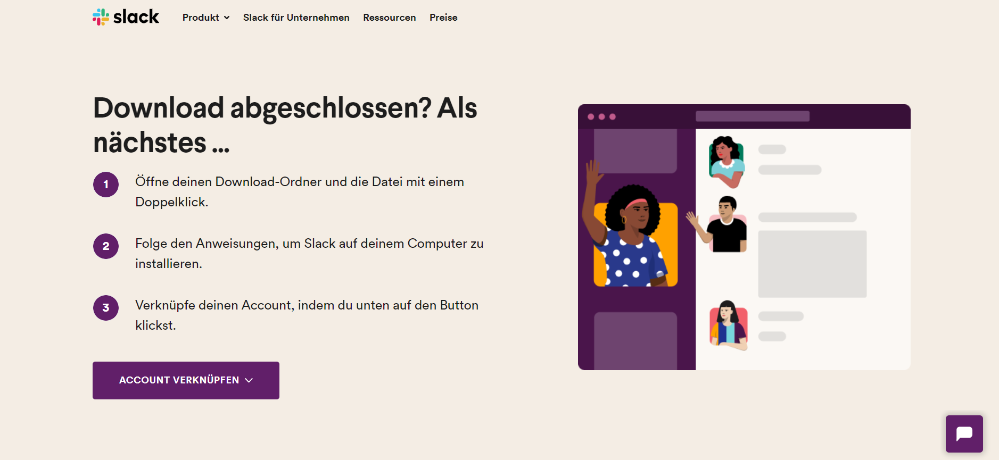

# Einrichtung

Wir können Slack sowohl als Desktop, Mobil wie auch als Web-Anwendung nutzen.

Für den Kurs wird empfohlen Slack sowohl Mobil, wie auch als Desktop anwendung zu nutzen, und nicht als Web-Anwendung. So sind wir immer erreichbar, sowohl für mitschüler, wie auch für Lehrer und Mitarbeiter des DCI. 

Ausserdem sind wir dadurch nicht vom Browser abhängig, und Slack läuft weiter, auch wenn wir mal den Browser Neustarten müssen.

## Download

Den Slack-Client können wir unter folgendem Link downloaden: https://slack.com/intl/de-de/downloads

## Installation

Um Slack zu installieren, folgen wir den Anweisungen die im Browser angezeigt werden.

## Betreten unseres Workspaces

Unseren workspace betreten wir, indem wir uns bei slack anmelden und dann unter "In einem Workspace anmelden" den Anweisungen folgen. 
Wenn wir nach dem Workspace gefragt werden, geben wir `d02-1.slack.com` ein.