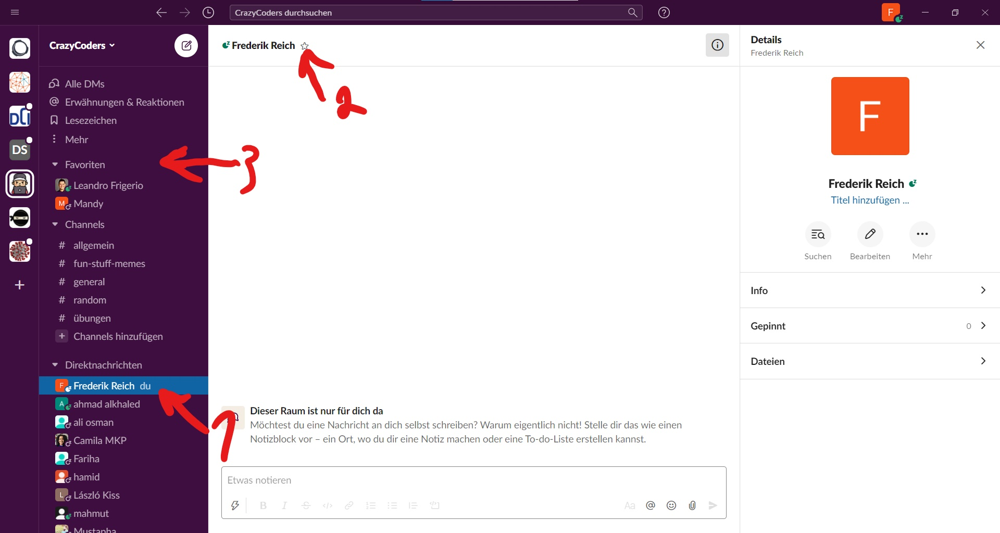

# Benutzung

## Favoriten

Wenn wir mit einem Teilnehmer besonders gerne Schreiben, können wir ihn als Favorit markieren, um ihn schneller wiederzufinden.

Dafür befolgen wir die folgenden Schritte:
- (1) Wir klicken auf den Benutzernamen.
- (2) Wir klicken im Chatfenster oben neben dem Benutzernamen auf den Stern.
- (3) Jetzt können wir den Benutzer oben Links unter Favoriten finden.