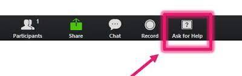

# Einrichtung

Wir können Zoom sowohl als Desktop, Mobil wie auch als Web-Anwendung nutzen. Für unseren Kurs empfiehlt es sich aber, Zoom als Desktop-Anwendung zu nutzen.

## Download

Den Zoom-Client können wir unter folgendem Link downloaden: https://zoom.us/support/download

## Installation

Um Zoom zu installieren, Doppelklicken wir nach dem Download auf die installationsdatei und folgen den Anweisungen auf dem Bildschirm.

## Unser Kanal

Unseren Zoom Kanal können wir betreten, indem wir in unserem Slack Workspace auf den Link klicken, der im Kanal #allgemein hinterlegt wurde.

## Hilfe holen, wenn in Breakout-Rooms

