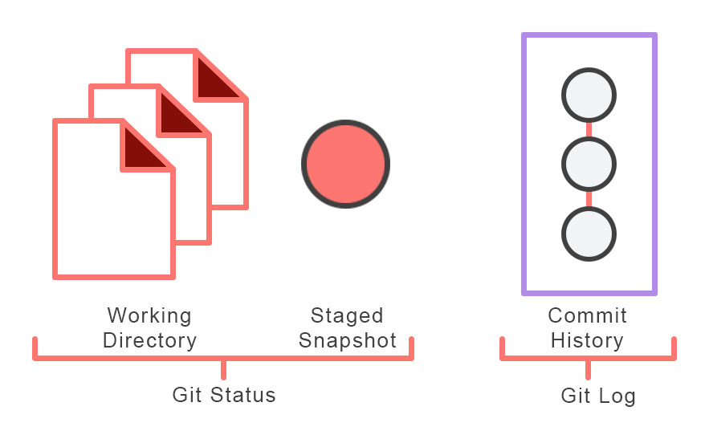
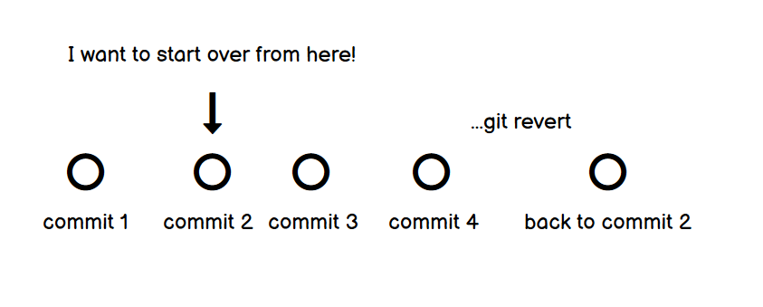

# Typische Git Befehle

| Befehl                               | Erklärung                                                                                |
|--------------------------------------|------------------------------------------------------------------------------------------|
| `$ git init`                         | Wenn wir diesen Befehl in einem order ausführen, erstellen wir hier ein neues Repository |
| `$ git status`                       | Zeigt uns den aktuellen Status eines Branches an, zb ob eine Datei verändert wurde       |
| `$ git add .`                        | fügt der Stage alle aktuellen veränderungen hinzu                                        |
| `$ git add [dateiname]`              | fügt der Stage spezifische Datein hinzu                                             |        
| `$ git rm [dateiname]`               | löscht eine spezifische Datei aus dem git repository                                     |
| `$ git commit -m "[nachricht]"`      | erstellt einen commit. Wichtig: erst adden, dann commiten, nachricht nicht vergessen     |
| `$ git push`                         | Ein repo von lokal auf github aktualisieren (hochschieben)                               |
| `$ git log`                          | gibt ein detailliertes log über alle commits des repos aus                               |
| `$ git log -p`                       | gibt ein detailliertes log mit allen änderungen der commits aus                          |
| `$ git log --pretty=oneline`         | gibt ein komprimiertes log mit ID und message des commits aus                            |
| `$ git revert [commit ID] --no-edit` | stellt einen früheren commit wieder her |
| `$ git fetch`                        | git fetch importiert Commits von einem Remote-Repository in das lokale Repo              |
| `$ git merge`                        | nach einem git fetch werden die Änderungen mit merge eingefügt
| `$ git pull`                         | ein repo auf github auf lokal aktualisieren (runterziehen) fetch + merge in einem Schritt) |
| `$ git clone [link von github]`      | ein repo local kopieren        | 

## Git Cheat-Sheet
:bulb: wissen heißt - wissen, wo es steht:
*[Cheat sheet ansehen](https://education.github.com/git-cheat-sheet-education.pdf)*

---

<h3 align="center">Visuelle Hilfen</h3>

