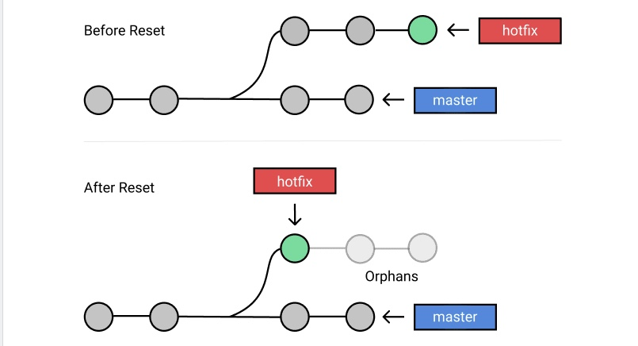
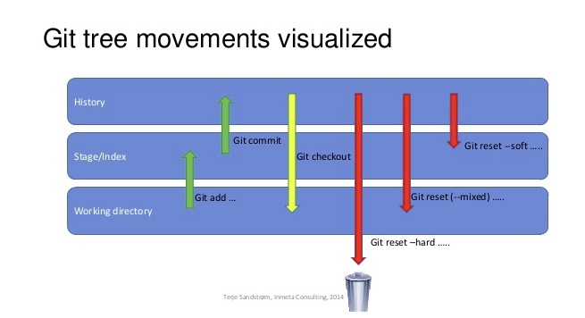
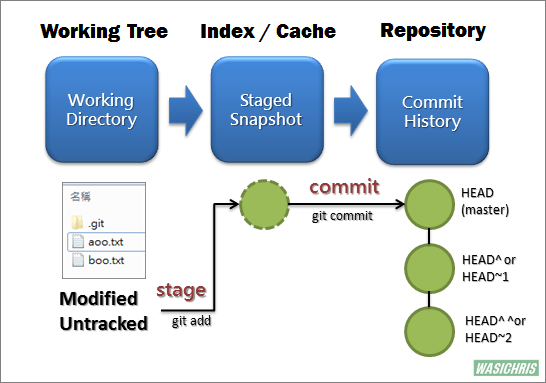
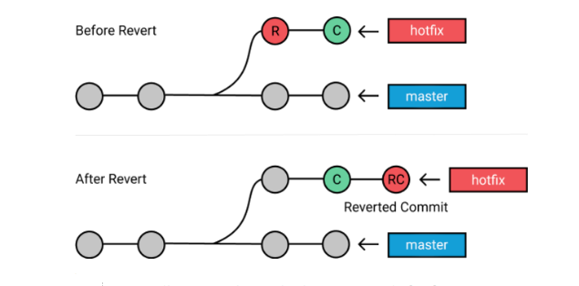

# Fehler korrigieren

**Git Reset vs Git Revert** - zwei Kommandos die leicht verwechselt werden können - beide helfen uns dabei Fehler wieder rückgängig zu machen

## Git Reset

`git reset HEAD` erlaubt uns zu einem früheren commit zurück zu gehen - **Achtung!** die commits danach werden auf diese Weise gelöscht. Die commit History dadurch verändert

Wir können Git sagen, was mit unserem Index (Dateien, welche in den nächsten commit aufgenommen werden) passieren soll, indem wir dem `git reset` eine der folgenden Optionen angeben

`--soft`: setzt nur den HEAD* auf einen früheren commit zurück, index und das working directory bleiben erhalten. Alle Dateien zwischen dem ursprünglichen HEAD und dem HEAD auf den wir nun zeigen, werden der Staging Area übergeben  
*(HEAD is a reference to the last commit in the currently check-out branch.)

`--mixed`:(default-option) setzt auch den HEAD auf einen früheren commit zurück, zusätzlich wird jedoch auch der index zu dem 
früheren commit zurückgesetzt. Änderungen in unserem Arbeitsverzeichnis bleiben weiterhin erhalten

`--hard`: setzt HEAD, index und Arbeitsverzeichnis auf den früheren commit zurück

ohne option flag => (default option --mixed)
* `git reset HEAD^`- setzt die commit refernce (HEAD) zum vorherigen commit zurück 
* `git reset HEAD~2`- setzt die commit refernce 2 commits zurück usw.

---
## Git Revert

* Wenn wir mit anderen zusammen arbeiten und unser repo bereits auf remote gepusht haben, kann es zu Problemen führen, wenn wir die commit History verändern

`git revert` erstellt einen neuen commit, aus dem commit auf dem wir zurückgreifen. Wir erstellen eine Kopie und bewegen uns von dieser Kopie weiter. Frühere commits werden nicht gelöscht. Die commit history bleibt erhalten.

---
## commit message ändern

`git commit --amend -m 'new message'` ändert die commit Nachricht meines letzten commits