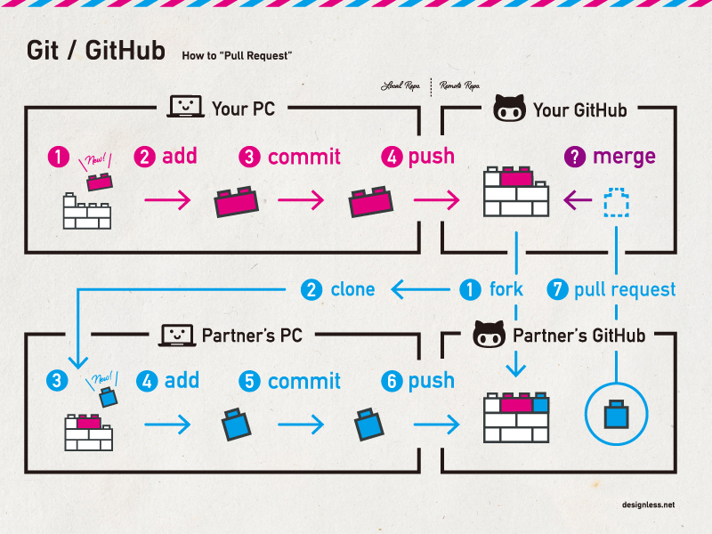
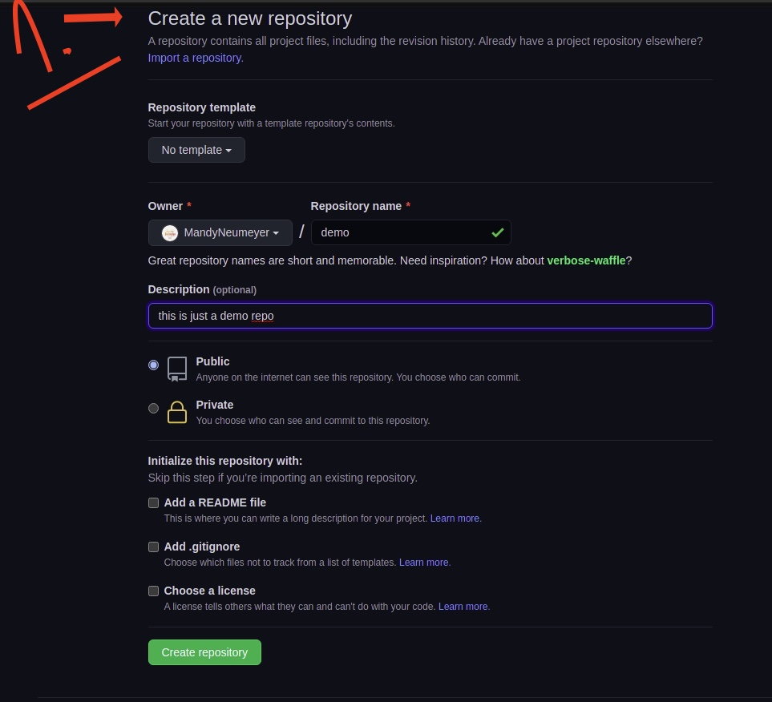
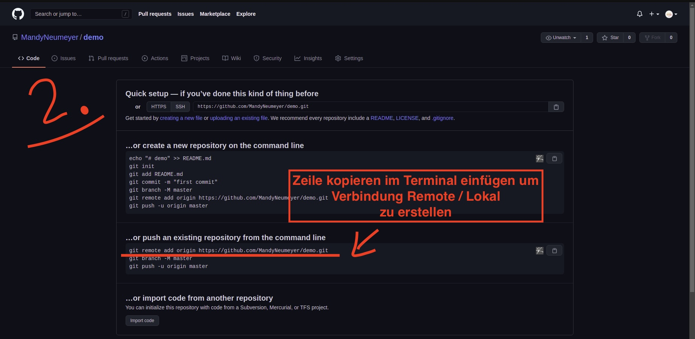
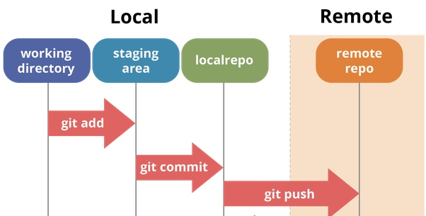

# Was ist Git / GitHub ?

### Git
ist ein Versionskontrollsystem, welches ursprünglich von Linus Torvalds, dem berühmten Entwickler des Linux Betriebssystem-Kernel, entwickelt wurde. Git wird also für die Versionierung von Dateien eingesetzt. Es dient uns dazu die eigenen Änderungen zu überwachen, sie rückgängig zu machen, sie anderen über sogenannte "Repositories" (Repos) zur Verfügung zu stellen oder Aktualisierungen von anderen einzuholen.  Git ist ein verteiltes System: Jeder Entwickler verfügt lokal über den gesamten Verlauf des Code-Repositorys.

### GitHub
GitHub (eine Zusammensetzung aus den Begriffen Git und Hub) bietet einen Cloud-basierten Git Repository Hosting Service an. Im Wesentlichen macht es Einzelpersonen und Teams viel einfacher, Git für Versionskontrolle und Zusammenarbeit zu nutzen.

### Workflow Git <--> GitHub 


## Git auf meinem Rechner einrichten

Bevor wir Git nutzen können, müssen wir git sagen wer wir sind, das machen wir indem wir unsere Daten mit folgenden Befehlen in die globale Konfigurationsdatei von Git schreiben:

- `git config --global user.email [unsere email adresse]` - mit diesem Befehl fügen wir unsere Email-Adresse hinzu.
- `git config --global user.name "[unser name]"` - mit diesem Befehl fügen wir unseren Namen hinzu.

Wir dürfen bei der Eingabe des Namen`s die sogenannten "Gänsefüßchen" nicht vergessen, da es sich hierbei um einen text-string handelt.

Wenn alles geklappt hat, müssten wir mit dem befehl `git config --list` unsere eingegebenen Daten sehen können.

## Wie kann ich ein Git Repository anlegen ?

Ihr habt zwei Möglichkeiten, ein Git-Repository auf eurem Rechner anzulegen.
Ihr könnt ein lokales Verzeichnis, das sich derzeit nicht unter Versionskontrolle befindet, in ein Git-Repository verwandeln mit:

``` git
$ git init
``` 
oder
Ihr könnt ein bestehendes Git-Repository von einem anderen Ort aus klonen.

``` git
$ git clone <url>
``` 

In beiden Fällen erhaltet Ihr ein einsatzbereites Git-Repository auf eurem lokalen Rechner.

## Wie werden die Änderungen meines Projektes "gespeichert" ?

 Die Befehle ```git add, git status, and git commit ```werden alle in Kombination verwendet, um einen Snapshot des aktuellen Zustands eines Git-Projekts zu speichern.
 Der git add Befehl fügt, für den nächsten Commit, Inhalte aus dem Arbeitsverzeichnis der Staging-Area (bzw. „Index“) hinzu. Bei der Ausführung des Befehls git commit wird standardmäßig nur diese Staging-Area betrachtet, so dass mit git add festgelegt wird, wie euer nächster Commit-Schnappschuss aussehen soll.


<hr>

## lokal auf GitHub pushen (wenn noch keine Verbindung besteht)
- zunächst ein leeres repo auf GitHub anlegen und git remote add origin <url> Zeile kopieren und im Terminal einfügen bevor push (um lokal mit remote zu verbinden)
``` git
$ git remote add origin <url>
``` 


<p>


</p>

## lokales repo wird mit ```git push ``` auf GitHub (dem zentralen Repo) hinzugefügt

Nach dem Vornehmen von Änderungen an einem lokalen Repository werden die Änderungen per Push in der Cloud für uns gesichert bzw. für Teammitglieder an anderen Standorten freigegeben 

Beim ersten Hochladen („push“) muss angegeben werden, welcher denn der Standard-Branch sein soll für Pushes. In unserem Fall soll das wieder der Master-Branch im „origin“-Repo sein:

``` git
$ git push --set-upstream origin master>
``` 

Jeder weitere Push kann ohne eine Branch-Angabe ausgeführt werden:

``` git
$ git push 
``` 



## durch GitHub (unser remote Repo) ist es möglich den Code mit anderen gemeinsam zu bearbeiten. 
**durch ```fork, pull-request``` und ```merge```**

**```fork```**

Der Fork ist eure eigene Kopie eines Repositories auf GitHub. Sie erlaubt euch in einer sicheren Umgebung mit dem Code zu experimentieren 

**```pull-request```**

Wenn Ihr eure Änderungen fertiggestellt habt und diese in das betreffende Projekt einfliessen lassen wollt, dann verwendet Ihr einen  "pull-request". Dieser wird dann vom Eigentümer des Orginal Repositories geprüft.

**```merge```**

sollte der Eigentümer des Orginal Repos mit den vorgenommen Änderungen einverstanden sein, werden diese mit merge (engl.für verschmelzen) übernommen.


