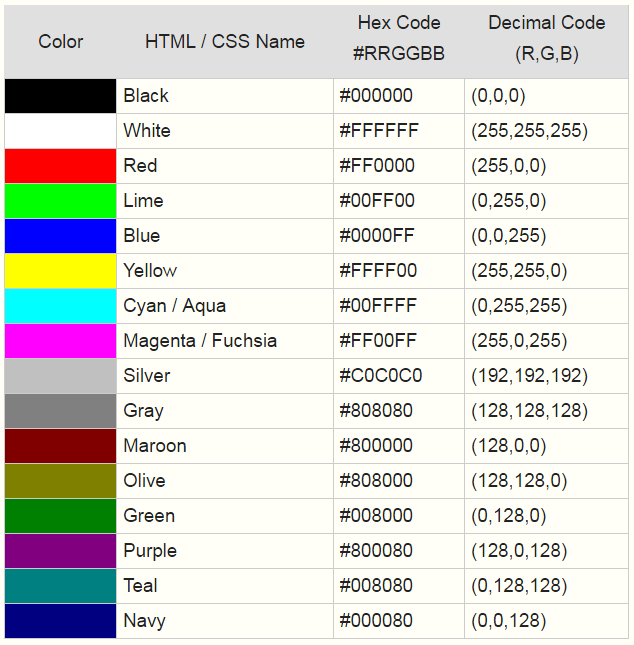
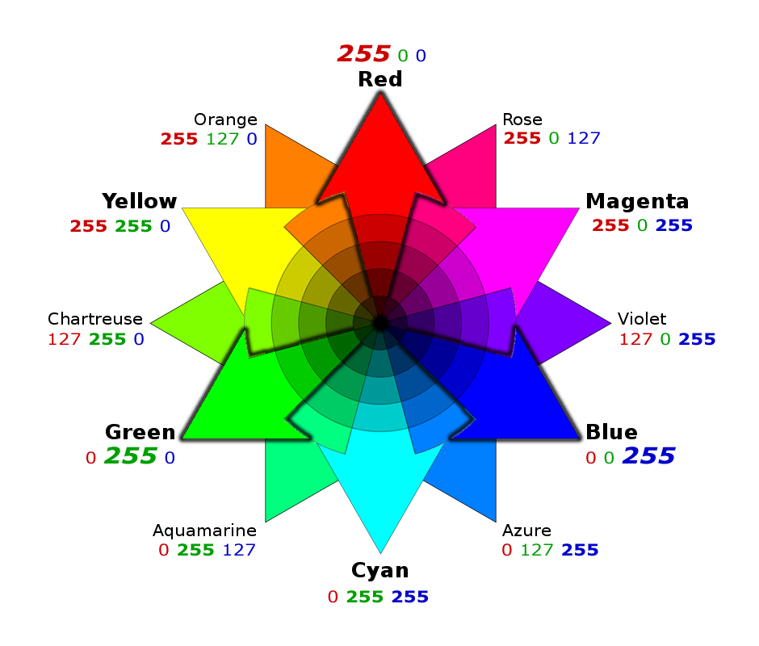
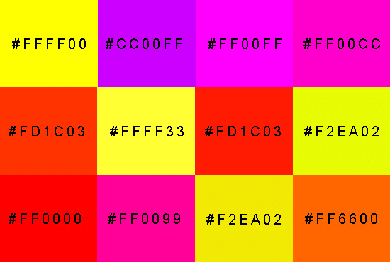
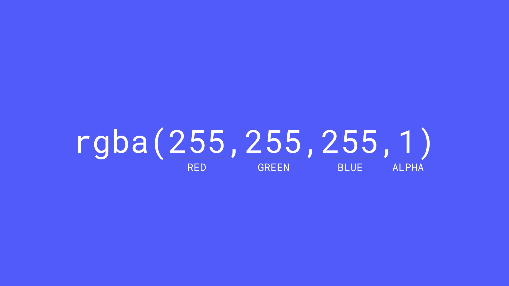
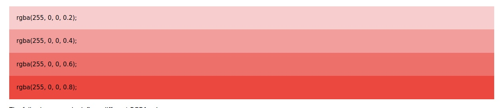
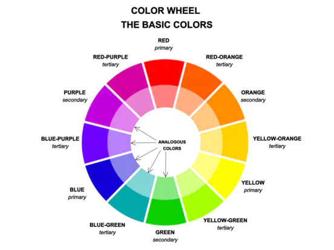

# Colors in CSS

- wir können Farben in CSS entweder mit dem **Farbnamen**,dem **Hex Wert** oder dem **RGB Wert** bestimmen.

### Farbnamen

eine Liste zu den unterstützten Farbnamen aller modernen Browsers findest du hier: [Liste Farbnamen](https://www.w3schools.com/colors/colors_names.asp)

### RGB und Hex Werte

Das RGB-Farbmodell beruht auf den Grundfarben Rot, Grün, Blau, wobei andere Farben durch mischen unterschiedlicher Anteile der drei Grundfarben erzielt werden.Der jeweilige Anteil wird für jede Grundfarbe einzeln in Form eines 8-Bit-Wertes, d. h. dezimal 0 - 255, hexadezimal 00 - FF angegeben. Insgesamt lassen sich somit 256 × 256 × 256 = 16.777.216 Farben codieren. Die Notierung erfolgt in hexadezimalen Werten der Form #RRGGBB, wobei #000000 Schwarz und #FFFFFF Weiß entsprechen. 

### `color: rgb(255, 255, 255)`(0-255)  `color: #RRGGBB` (0 -> 9 A -> F) 

   

mehr Info in W3schools
:point_right:[RGB](https://www.w3schools.com/html/html_colors_rgb.asp)
:point_right:[Hex](https://www.w3schools.com/html/html_colors_hex.asp)

### RGBA
**Als Besonderheit können wir RGB zusätzlich um den Alphakanal erweitern (RGB -> RGBA)**

das a in rgba – gibt die Transparenz einer Farbe mit Werten zwischen 0 und 1 an. 0 ist vollständig transparent oder durchsichtig, 1 ist voll deckend oder opakt. Alles dazwischen ist halb deckend oder semitransparent und läßt den Hintergrund durchscheinen.

---
**Color-Wheel**

:point_right:[mit dem Farbkreis die perfekte Farbkombo finden](https://www.logogeist.de/blog/farbkreis-mit-dem-farbkreis-die-perfekte-farbkombination-finden)

---

**ein paar coole color Tools von euch gepostet**

:point_right:[Colour Lovers](https://www.colourlovers.com/)\
:point_right:[Adobe](https://color.adobe.com/create/color-wheel)\
:point_right:[Colorhunt](https://colorhunt.co/)\
:point_right:[W3schools HTML Color Picker](https://www.w3schools.com/colors/colors_picker.asp)\
:point_right:[Khroma AI color tool](http://khroma.co/)

**Erweiterung für Google Chrome um die Farbwerte anderer Webseiten zu bestimmen und für die eigene zu kopieren**

:point_right:[Google Chrome Erweiterung](https://chrome.google.com/webstore/detail/colorzilla/bhlhnicpbhignbdhedgjhgdocnmhomnp?hl=en )

**Barrierefreiheit**

:point_right:[Farbblindheit (engl)](https://uxdesign.cc/color-blindness-in-user-interfaces-66c27331b858)\
:point_right:[Wie designe ich für Farbblinde? (engl)](https://usabilla.com/blog/how-to-design-for-color-blindness/)\
:point_right:[Testtool wie meine Seite auf unterschiedliche Farbblindheiten wirkt)](https://www.toptal.com/designers/colorfilter/)

