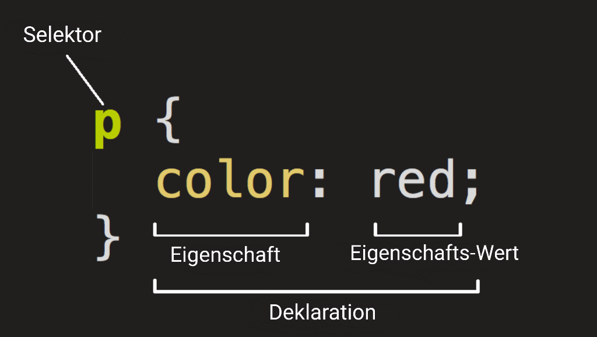
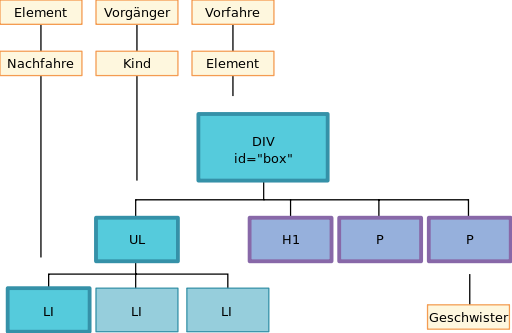
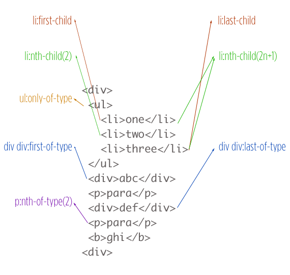

## Selektoren

Damit wir Elemente auf einer Website gestalten können, müssen wir zunächst festlegen welche Elemente angesprochen werden sollen. Mit Hilfe von CSS-Selektoren treffen wir diese Auswahl. 

Um das passende Element auszuwählen gibt es viele verschiedene Selektoren für verschiedene Anwendungsbereiche. Es gibt einfache Selektoren, Kombinatorselektoren (Kombinatoren sind Zeichen, die zwei Selektoren miteinander verketten) und Pseudoklassen, welche hinter einen bestimmten Selektor gestellt werden. 

**Beispiele für Selektoren**

| Selektorname      | wählt aus?                                                        | Syntax                        |
|-------------------|-------------------------------------------------------------------|-------------------------------|
| Universalselektor | spricht jedes Element im Elementbaum an                           |*                              |
| ID-Selektor       | spricht jedes Element einer bestimmten ID an                      |#ID                            |        
| Klassenselektor   | spricht alle Elemente einer bestimmten Klasse an                  |.klassenname                   |     
| Typselektor       | spricht alle Elemente eines bestimmten Typs an                    |elementenname Bsp. (p, div, h1)|   
| Attributselektor  | spricht alle Elemente an, die ein bestimmtes Attribut besitzen    |[attributname] bsp [href]| 
| Attributwert      | alle Elemente, die ein bestimmtes Attribut mit einem bestimmten Wert besitzen|[attributname=attributwert]|
| Kindselektor      | alle Elemente, die direkte Kinder eines anderen Elements sind     |div > p                        |            
| Pseudoklasse :last-child    | filtert das letzte Element eines Elternelements       |li:last-child             |
| Pseudoklasse :hover| kennzeichnet alle Elemente, die mit der Maus berührt werden    |a:hover                        |

---

**mehr Info**

- eine gute Überischt über alle Selektoren bietet die [W3schools](https://www.w3schools.com/cssref/css_selectors.asp)

- gutes Lesematerial zu den [Attributselektoren](https://www.w3schools.com/css/css_attribute_selectors.asp)

- gutes Lesematerial zu [Pseudoklassen](https://developer.mozilla.org/de/docs/Web/CSS/Pseudo-classes)

- gutes Lesematerial zu den 
[Kombinatorselektoren](https://www.mediaevent.de/css/css-selektor-kontextselektor.html)

- interaktives Spiel zum Erlernen der Selektoren [CSS Dinner](https://flukeout.github.io/)

---

