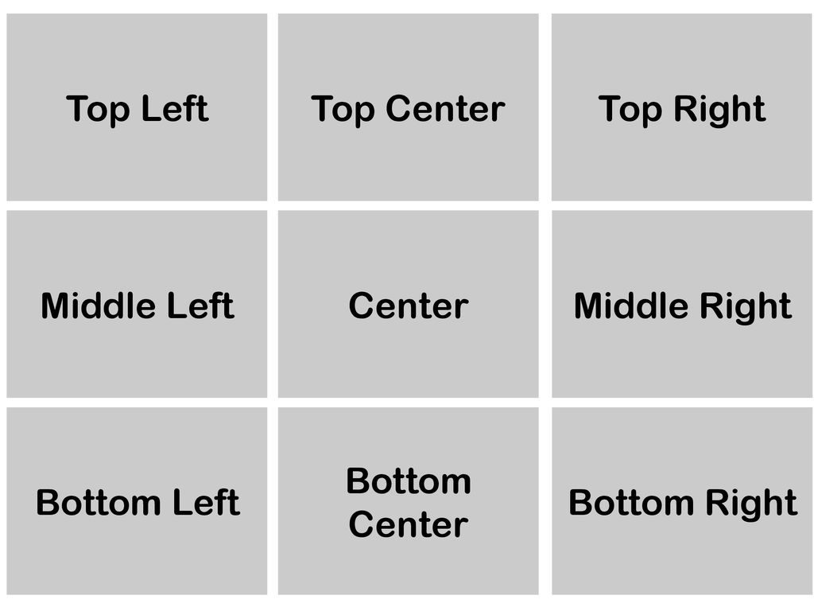
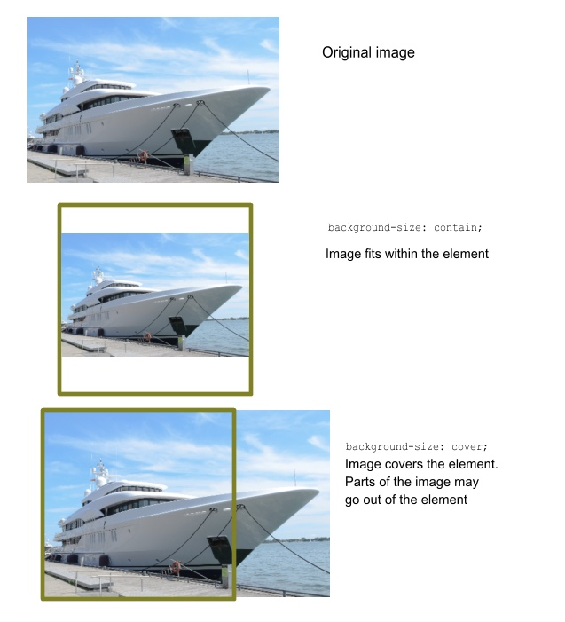

## background-images 

`background-image`: `url(image-url)`;

der browser füllt die box mit image, ohne dabei auf das image selbst zu achten. wir haben Optionen um dieses anzupassen.

**die wichtigsten sind:**

`background-size:contain` stellt sicher, das das gesamte orginal Bild in der Box angezeigt wird. Ist das Orginalbild größer wird es so angepasst das es proportional in die Box passt. Dabei kann jedoch Freiraum in der Box bleiben.

`background-size:cover` Bedeckt die gesamte Box mit Bild. Es zeigt dabei jedoch nicht zwingend das gesamte orginal Bild mehr an - Das Bild wird proportional vergrößert bzw. verkleinert in unserer Box dargestellt. Mit `background-position` `left`, `center`, `right`, `bottom`, und `top`können wir angeben, welcher Teil des Bildes angezeigt werden soll. Die default position ist `top``left`

 

 

**mehr Lesematerial**

:point_right:[CSS-tricks bg-image](https://css-tricks.com/almanac/properties/b/background-image/)\
:point_right:[fastweb bg-image](http://fastwebstart.com/background-image-html/)

