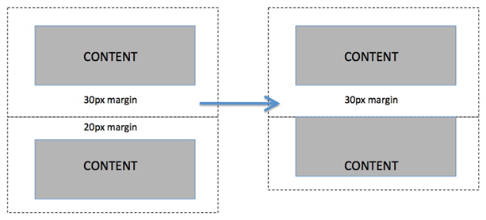

# Box - Model (**boxes everywhere**)

Das CSS Box Model beschreibt wie Block-Elemente vom Browser dargestellt werden. Jedes Element hat eine Größe `width`/ `height` (Content Box), die von den drei Boxen `padding` (Padding-Box), `border` (Border-Box) und `margin`(Margin-Box) umgeben wird. Der vollständige Platzbedarf eines Elements bestimmt sich aus der Summe aller Boxen.

 

**content + padding (Innenabstand) + border + margin (Außenabstand)**

Mit dem CSS Befehl `box-sizing`, lässt sich das Box Model von CSS manipulieren
die Eigenschaft `box-sizing` legt fest, worauf sich die Abmessungen `width`/`height` in unseren Angaben beziehen

wir unterscheiden hier:\
`content-box` - diese Angabe gilt nur für den Inhalt \
`border-box`  - diese Angabe gilt für den Inhalt, Innenabstand und Rahmen, aber nicht für margin

*default Wert, wenn wir keine Angaben machen ist `content-box`

**mehr Info**\

:point_right:[w3schools box-model)](https://www.w3schools.com/css/css_boxmodel.asp)

---

### Achtung collapsing margin (CSS the weird parts)

**survival of the fittest**
wenn wir zwei boxen mit margin haben (einmal margin-bottom und einmal margin-top) überschreiben sie sich gegenseitig. Es gewinnt der "Stärkere". Anders sieht es aus, bei zwei Angaben, wovon eine Angabe negativ margin enthält. In diesem Fall werden beide Angaben miteinander verrechnet.

 

**mehr Info**

:point_right:[w3schools - CSS margin collapsing](https://www.w3schools.com/css/css_margin_collapse.asp)\
:point_right:[mehr Info zu collapsing margins - CSS Tricks (engl)](https://css-tricks.com/what-you-should-know-about-collapsing-margins/)

