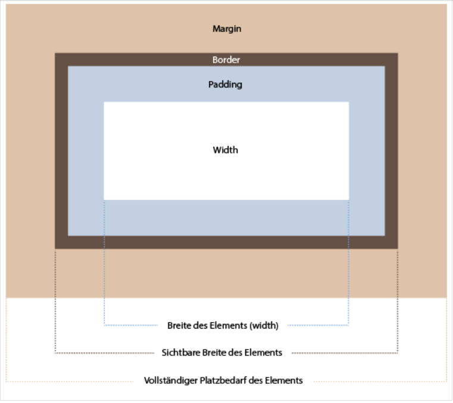

# Box-Model (**boxes everywhere**)

### Jedes Element auf einer Webseite ist eine Box. 
**Das CSS Box Model beschreibt wie diese Elemente vom Browser dargestellt werden** :point_right:[MDN Box Model](https://developer.mozilla.org/en-US/docs/Learn/CSS/Building_blocks/The_box_model)


Bei den Boxen unterschieden wir zwischen: den Inline-(z.b.`img`,`span`, `a`, `button`) und den Block-Elementen (z.b.`p`,`div`,`h1`). 

 

### Block-Elemente 

Das CSS Box Model beschreibt wie Block-Elemente vom Browser dargestellt werden. Jedes Element hat eine Größe `width`/ `height`(Content Box), die von den drei Boxen padding (Padding-Box), border (Border-Box) und margin(Margin-Box) umgeben wird. Der vollständige Platzbedarf eines Elements bestimmt sich aus der Summe aller Boxen.

 

**content + padding (Innenabstand) + border + margin (Außenabstand)**

---
Mit dem CSS Befehl `box-sizing`, lässt sich das Box Model von CSS manipulieren
die Eigenschaft `box-sizing` legt fest, worauf sich die Abmessungen `width`/`height` in unseren Angaben beziehen

wir unterscheiden hier:\
`content-box` - diese Angabe gilt nur für den Inhalt \
`border-box`  - diese Angabe gilt für den Inhalt, Innenabstand und Rahmen, aber nicht für margin

*default Wert, wenn wir keine Angaben machen ist `content-box`

---
### Achtung HTML Elemente kommen mit default Werten (u.a. für margin/ padding)
mit einer reset methode (bspw. normalize.css) lassen sich die Elemente leichter kontrollieren

:point_right:[CSS Default Werte einzelner HTML Elemente](https://www.w3schools.com/cssref/css_default_values.asp)

### Achtung collapsing margin (CSS the weird parts)

**survival of the fittest**
wenn wir zwei boxen mit margin haben (einmal margin-bottom und einmal margin-top) überschreiben sie sich gegenseitig. Es gewinnt der "Stärkere". Anders sieht es aus, bei zwei Angaben, wovon eine Angabe negativ margin enthält. In diesem Fall werden beide Angaben miteinander verrechnet.

 

**mehr Info**

:point_right:[w3schools - CSS margin collapsing](https://www.w3schools.com/css/css_margin_collapse.asp)\
:point_right:[mehr Info zu collapsing margins - CSS Tricks (engl)](https://css-tricks.com/what-you-should-know-about-collapsing-margins/)

### Inline-Elemente 

Inline Elementen können wir keine `width`, `height` zuweisen. `margin-top`,`margin-bottom`,
`padding-top` und `padding-bottom` verschieben anderen Inhalt nicht.
*benötigt man vertikale Abstände, kann man Inline-Elementen die Eigenschaft line-height zuweisen
Horizontal padding, margins, und borders können wieder ganz normal angewendet werden.


*inline Elemente, die von außen kommmen bspw. `img` verhalten sich wie Block Elemente. (d.h. sie haben eine `width` and `height`)

### `display` property 
**wir können die default Werte der Elemente überschreiben. d.h. wir können festlegen, wie die Elemente vom Browser gerendert werden sollen:**

```css
display:block;
display:inline;
display:inline-block;
display:none;
```


**mehr Info**

:point_right:[display property](https://www.w3schools.com/cssref/pr_class_display.asp)\
:point_right:[CSS Box Modell für inline Elemente](https://www.edv-lehrgang.de/css-box-modell-fuer-inline-elemente/)\
:point_right:[w3schools box model](https://www.w3schools.com/css/css_boxmodel.asp)\
:point_right:[MDN box model](https://developer.mozilla.org/en-US/docs/Learn/CSS/Building_blocks/The_box_model)\
:point_right:[boxes and borders Cheat sheet](https://learn-the-web.algonquindesign.ca/topics/boxes-borders-cheat-sheet/)

