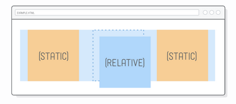
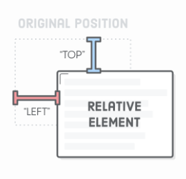
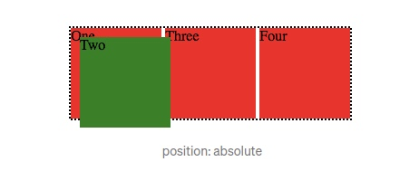
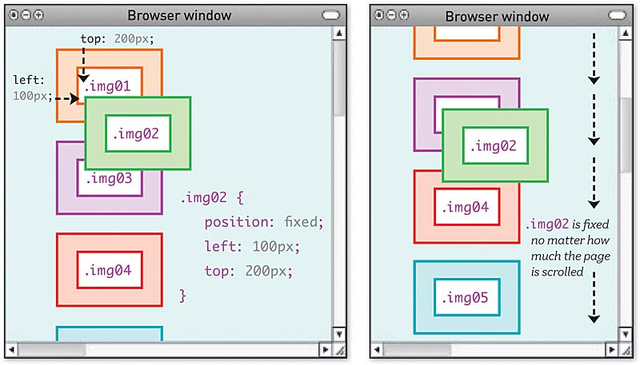
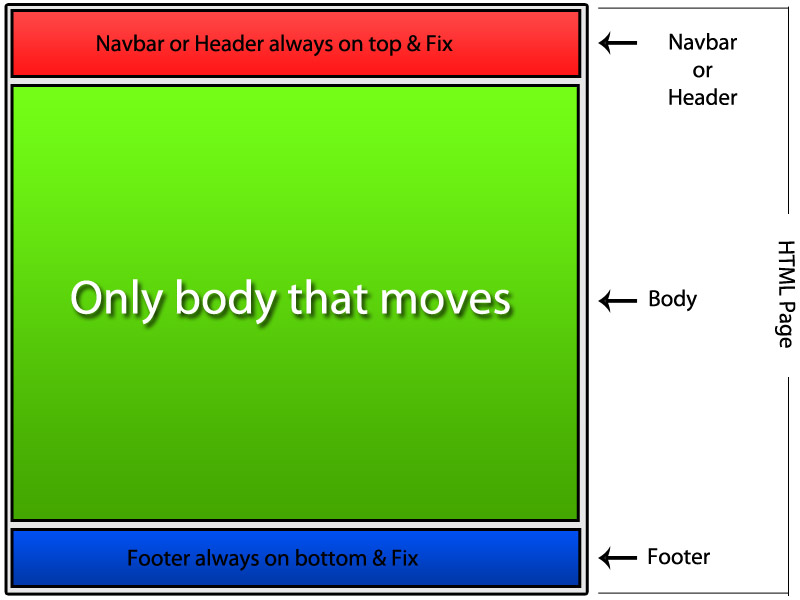
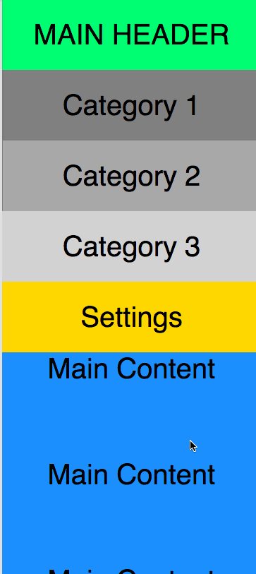
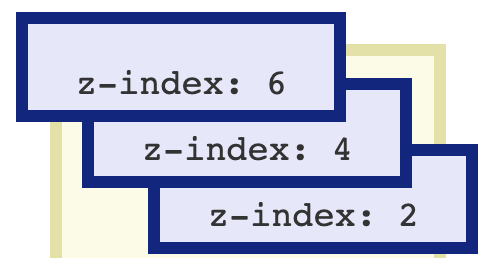

# CSS positioning

### static - relative - absolute - fixed - sticky

Elemente können durch einer der positions Eigenschaften aus dem normalen Elementfluss entfernt werden und an jede beliebige Stelle des Viewports positioniert werden. 

* **`static`** (Standardwert) Das Element verbleibt im Textfluss. `top`, `bottom`, `left`, `right` werden ignoriert.

* **`relative`** Das Element kann mit `top`, `bottom`, `left`,`right` und `z-index` von seiner Orginalposition verschoben werden; es bleibt aber eine Lücke im Textfluss. Das Layout anderer Elemente wird nicht verändert.

 
 

* **`absolute`** Nimmt das Element komplett aus dem normalen Elementenfluss. Es existiert nicht mehr und andere Elemente rücken nach. Das Element kann mit `top`, `bottom`, `left`,`right` und `z-index` **zum nächsten nicht statischen Elternelement** positioniert werden. Sollten alle Elternelemente statisch sein, wird das Element `relative` zum viewport window positioniert. 

 

* **`fixed`** Ein Element mit position `fixed` kann relative zum viewport window positioniert werden. Es bleibt immer an dieser Position auch wenn die Seite hoch - bzw. runtergescrollt wird. `top`, `bottom`, `left`, `right` und `z-index` können verwendet werden.

 
 

* **`sticky`**  wie fixed, aber es wird erst fest, wenn die Seite zu einem bestimmten, festgelegten Punkt gescrollt wird.

 

### Was ist der z-index?

wenn Elemente sich überlappen, hilft der z-index dabei zu bestimmen, in welcher Reihenfolge die Elemente angezeigt werden sollen.  Elemente mit einem größeren z-index liegen dabei näher am Betrachter und können Elemente mit kleinerem z-index überlagern.

 
 

