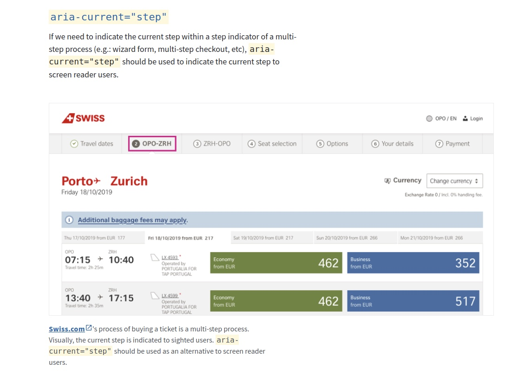
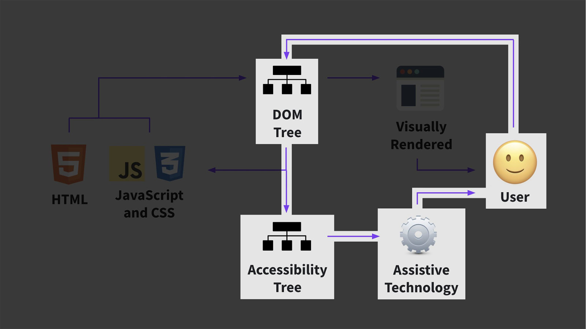

# Barrierefreiheit 

### Warum ist Semantik wichtig?

Wichtig ist die semantische Auszeichnung vor allem, da Suchmaschinen den Quellcode lesen und anhand der verwendeten HTML-Tags die Wichtigkeit von Inhalten ableiten. Außerdem erleichtern semantische Elemente Screenreadern das Auslesen des Quellcodes um ihn sehbehinderten Menschen vorzulesen.

Ein semantisches Element beschreibt deutlich seine Bedeutung sowohl für den Browser und den Entwickler.
Beispiele für nicht-semantische Elemente: `
` und `` - diese weisen nicht auf ihren Inhalt hin.
Beispiele für semantische Elemente: `<form>` , `<table>`, `<header>`, `<article>` und `` - hiermit wird der Inhalt klar definiert. 

 
 

---
### wenn es kein sematisches HTML Element oder Attribut gibt hilft uns Aria (Accessible Rich Internet Applications) beim Erstellen des sogenannten Accessible Tree´s *

 
 

 

*Accessible Tree ist ein sogenannte Baumdarstellung für Unterstützungstechnolgie (Bsp. Screenreader)

---

**mehr Lesematerial**

:point_right:[die wichtigsten Faktoren, einer barrierefreien Webseite](https://www.mindshape.de/kompetenzen/website-optimierung/ux-und-usability-optimierung/barrierefreie-websites.html)\
:point_right:[the right tag for the right job](https://localghost.dev/2021/06/the-right-tag-for-the-job-why-you-should-use-semantic-html/)\
:point_right:[quick guide to accessibility](https://www.notion.so/A11y-intro-b559b4e344fa47318e417c1ce41e7d2e)\
:point_right:[w3schools to accessibility](https://www.w3schools.com/html/html_accessibility.asp)\
:point_right:[aria labels](https://a11y-101.com/development/aria-label)

**Tools**

:point_right:[Lighthouse - teste deine Webseite auf barrierefreiheit](https://developers.google.com/web/tools/lighthouse)\
:point_right:[Chrome Dev Tools zum Testen meiner Seite mit verschiedenen Farbblindheiten](https://developers.google.com/web/tools/lighthouse)\
:point_right:[Browser Extension - Chrome Screenreader Simulation](https://chrome.google.com/webstore/detail/screen-reader/kgejglhpjiefppelpmljglcjbhoiplfn?hl=en)

