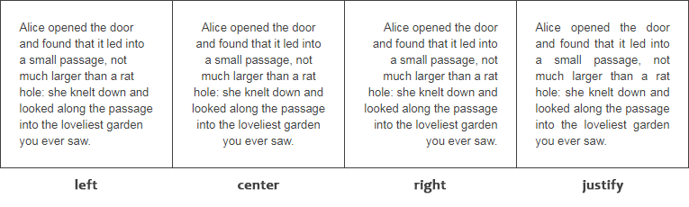
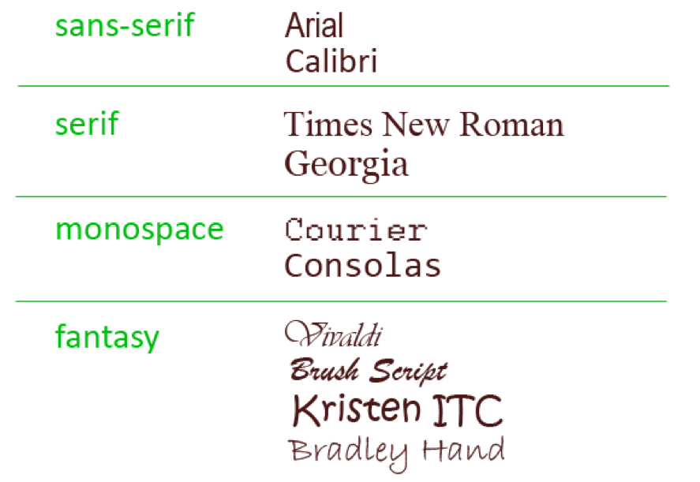
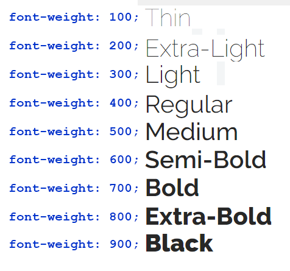
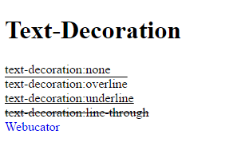
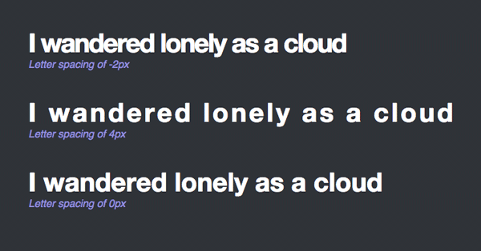
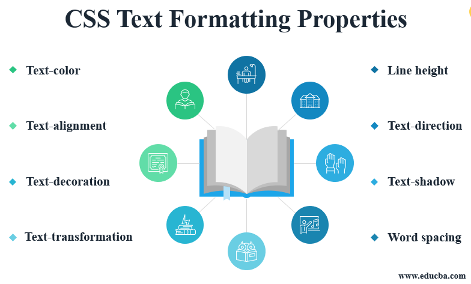

# Fonts & Text Styling

### Schriftgröße

Die CSS-Eigenschaft `font-size` spezifiziert die Schriftgöße. Wir können die Schrift in absoluten oder in relativen Einheiten bestimmen. Am häufigsten werden pixel (`px`), `rem` und `em` genutzt.

Root (HTML) Default Schriftgröße beträgt 16px. 

`rem`:wird immer relative zum Root Element (HTML tag) (1rem = 16px) berechnet\
`em`: wird relative zum Elternelement berechnet. Achtung durch nesting der Elemente kann es mit `em` sehr unübersichtlich werden

 

---
### Text ausrichten

CSS `text-align` richtet Texte und Inline-Elemente wie Bilder innerhalb eines Blockelements rechtsbündig, linksbündig, zentriert oder im Blocksatz aus.

`text-align`:`center`, `left`,`center`, `right`, `justify`

---

### Schriftart

Mit der Eigenschaft `font-family` können wir die zu verwendende Schriftart bestimmen. 

 

---
### Schriftart

Mit `font-weight`können wir die Schriftdicke bestimmen.

 

### Text dekorieren

Die folgenden Werte können wir für `text-decoration` verwenden.

`none` (Ohne Dekoration)
`overline` (Oberstrich)
`underline` (Unterstrich)
`line-through` (Durchgestrichen)

 

---

### Zeilenabstand

mit `line-height` können wir die Höhe einer Zeile bestimmen. Das sorgt für eine bessere Lesbarkeit.

 

### Buchstabenabstand

mit `letter-spacing` können wir den Abstand zwischen den Buchstaben verändern.

 

---

### Text transformieren `text-transform`

* `text-transform`:`capitalize` (setzt den ersten Buchstaben des Wortes auf Großschreibung)
* `text-transform`:`uppercase` (setzt das gesamte Wort auf Großschreibung)
* `text-transform`:`lowercase` (setzt das gesamte Wort auf Kleinschreibung)

---

 

**mehr Lesematerial**

:point_right:[font und Text Styling Deutsch](https://wiki.selfhtml.org/wiki/CSS/Eigenschaften/font-size)\
:point_right:[Medium Artikel rem vs em units in css](https://medium.com/@hossam.hilal0/rem-vs-em-units-in-css-96d5ac15878e)\
:point_right:[css-tricks](https://css-tricks.com/almanac/properties/f/font-size/)\
:point_right:[tips for using 3rd party fonts](https://www.afasterweb.com/2018/04/11/two-tips-for-using-3rd-party-fonts/)\
:point_right:[font-display](https://css-tricks.com/almanac/properties/f/font-display/)

