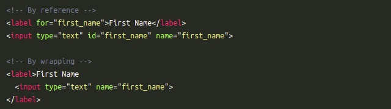

# Input Elemente

Das HTML-Element `input` ermöglicht es, interaktive Bedienelemente für webbasierte Formulare zu erstellen, die Daten vom Benutzer entgegennehmen. 

**Arten des `input`-Elements**

Wie ein `input` sich verhält hängt von seinem `type`-Attribut ab. 
Default `type`-Attribut ist `text`.

:point_right:[w3schools input types](https://www.w3schools.com/html/html_form_input_types.asp)

## Wozu brauchen wir das label? ##

* label gibt die Bezeichnung des Inputfelds für den User an
* es vergrößert den klickbaren Bereich für Benutzer mit der Maus. (erhöht damit die Nutzerfreundlichkeit)
* wird vom Screenreader genutzt

 

Das `input` muss entweder im `label`eingebettet sein **oder** aber das `for`-Attribut verbindet das `label` Tag mit dem `input`.
In dem Fall muss das `for`-Attribut des `label`-Tags denselben Wert wie das `id`-Attribut des Eingabefelds (input, textarea, button, select) aufweisen. Jedes Eingabefeld kann nur ein label-Tag haben.

## Wozu brauchen wir das `name`-Attribut?

Es wird verwendet, um die Formulardaten nach dem Absenden des Formulars zu referenzieren. (Beschreibt den Wert des Inputs)

:point_right:[w3schools input name](https://www.w3schools.com/tags/att_input_name.asp)


## Besonderheiten `name`-Attribut für `type="radio"`

Eine Gruppe wird durch das gleiche `name`-Attribut definiert. Zusätzlich brauchen wir einen `value`.
So würden wir bspw. das Formular abschicken mit `color`:`red`. Wenn der value red angeklickt wurde.

```css
<form>  
  <p>Kindly Select your favorite color</p>  
  <input type="radio" name="color" value="red"> Red <br>  
  <input type="radio" name="color" value="blue"> blue <br>  
  <input type="radio" name="color" value="green">green <br>  
  <input type="radio" name="color" value="pink">pink <br>  
  <input type="submit" value="submit">  
</form> 
``` 

## Checkboxen

**Bei Checkboxen gibt es verschiedene Möglichkeiten**

* ### Beispiel 1
```css
<form>
<fieldset>
  <legend>Choose your interests</legend>
  <div>
    <input type="checkbox" id="coding" name="interest" value="coding">
    <label for="coding">Coding</label>
  </div>
  <div>
    <input type="checkbox" id="music" name="interest" value="music">
    <label for="music">Music</label>
  </div>
</fieldset>
</form>
```
zum Beispiel wird gesendet: `interest`:`coding`

* ### Beispiel 2

```css
<form>
<fieldset>
  <legend>Choose your interests</legend>
  <div>
    <input type="checkbox" id="coding" name="coding">
    <label for="coding">Coding</label>
  </div>
  <div>
    <input type="checkbox" id="music" name="music">
    <label for="music">Music</label>
  </div>
</fieldset>
</form>
```
zum Beispiel wird gesendet: `coding`:`on`

Die Eigenschaft `value` ist nicht unbedingt erforderlich. Wenn beim Senden kein `value`-Attribut verwendet wird, wird der Wert auf 'on' gesetzt, wenn die checkbox ausgewählt wurde. In diesem Fall ist es jedoch wichtig, das wir die einzelnen checkboxen, durch unterschiedliche `name`-Attribute wieder voneinander unterscheiden können. So das wir, wenn das Formular abgeschickt wird, auch auslesen können, welche checkbox auf 'on' gesetzt wurde.

---

**mehr Lesematerial**

:point_right:[w3schools Attribute inputs](https://www.w3schools.com/html/html_form_attributes.asp)\
:point_right:[mdn inputs](https://developer.mozilla.org/en-US/docs/Web/HTML/Element/input)\
:point_right:[w3 forms](https://www.w3.org/TR/html401/interact/forms.html)\
:point_right:[html5-tutorial checkboxen](https://html5-tutorial.net/de/338/formulare/checkboxen/)\
:point_right:[style forms with css](https://blog.logrocket.com/how-to-style-forms-with-css-a-beginners-guide/)


