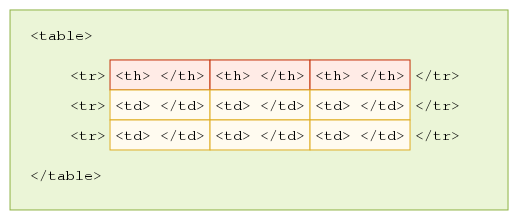
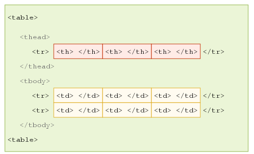
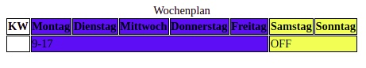

# Tabellen

HTML-Tabellen sind die semantisch passende Struktur, um tabellarische Daten in Zeilen und Spalten darzustellen.

### Einfache Tabellen



- das `th`-Element definiert eine Kopfzelle, die eine Überschrift für eine Gruppe von Zellen einer Tabelle ist. 
- das `tr`-Element repräsentiert eine Tabellenzeile. 
- das `td`-Element definiert eine Zelle einer Tabelle, die Daten enthält. 

---

### Komplexere Tabellen

Für komplexere Tabellen bietet sich eine Struktur mit `thead`, `tbody` und `tfoot` an. Übersichtlicher und zusätzliche Hooks für das Styling im CSS.
Für einen Screenreader macht es jedoch keinen Unterschied.

 

- im Tabellenkopf `<thead></thead>` die Zeilen der einfachen Tabelle, die ausschließlich Kopfzellen enthalten, 
- im Tabellenkörper `<tbody></tbody>` die Zeilen enthält, die ausschließlich oder hauptsächlich Datenzellen enthalten
- der Tabellenfuß `<tfoot></tfoot>`  enthält zusammenfassende oder die Tabelle erläuternde Daten


--- 
### Extras zu Tabellen

```html
<table>
    <caption>Wochenplan</caption>
    <colgroup>
        <col>
        <col span="5" class="werktag">
        <col span="2" class="wochenende">
    </colgroup>
    <tr>
        <th>KW</th>
        <th scope="col">Montag</th>
        <th scope="col">Dienstag</th>
        <th scope="col">Mittwoch</th>
        <th scope="col">Donnerstag</th>
        <th scope="col">Freitag</th>
        <th scope="col">Samstag</th>
        <th scope="col">Sonntag</th>
    </tr>
    <tr>
            <td></td>
            <td colspan="5">9-17</td>
            <td colspan="2">OFF</td>
    </tr>>
</table>
```
```css
<style>
.werktag{
    background-color:blue;
}
.wochenende{
    background-color:yellow;
}
</style>

```
 

- durch das `<caption>-Element` wird eine Tabellenüberschrift definiert. Die Deklaration muss unmittelbar nach dem einleitenden `<table>-Tag` erfolgen
- Das `<colgroup>-Tag` gibt eine Gruppe von einer oder mehreren Spalten in einer Tabelle zur Formatierung an. Es ist nützlich, um Stile auf ganze Spalten anzuwenden, anstatt die Stile für jede Zelle für jede Zeile zu wiederholen.
- das `scope-Attribut` gibt Screenreadern an, ob der `<th>` für eine Spalte `<col>` oder Zeile `<row>` oder Gruppe von Spalten `<colgroup>` oder Zeilen `<rowgroup>` ist.(`<colgroup>`und `<rowgroup>`brauchen zusätzlich auch das `colspan-Attribut` bzw. `rowspan-Attribut`)
- das `colspan-Attribut` gibt die Anzahl der Spalten an, die eine Zelle umfassen, das `rowspan-Attribut` die Anzahl der Zeilen
- `border-collapse: collapse` diese Eigenschaft legt fest, das der Tabellenrahmen zu einem einzigen Rahmen zusammenfallen soll

---
**mehr Lesematerial**

:point_right:[w3schools tables](https://www.w3schools.com/html/html_tables.asp)\
:point_right:[w3schools colgroup](https://www.w3schools.com/tags/tag_colgroup.asp)\
:point_right:[w3schools scope](https://www.w3schools.com/tags/att_th_scope.asp)\
:point_right:[mdn styling tables](https://developer.mozilla.org/en-US/docs/Learn/CSS/Building_blocks/Styling_tables)


