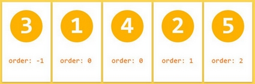
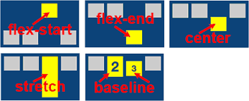

# Properties für die Childrens (flex-items)

Nicht nur der umgebende Container, sondern auch die einzelnen Kind-Elemente (engl. flex items) können mit Flexbox formatiert werden.

---

### **order**

order platziert jedes einzelne Element einer Flexbox in ein Feld der Wahl, ohne dabei die Reihenfolge des Inhalts im Markup zu ändern.


 \

default Wert ist 0.

```css
.flex-item {
  order: 2;
}
```
---

### **Align-self**

Mit align-self bekommt das flex-item eine andere Eigenschaft als die anderen Schwesterelemente, die durch die Eigenschaft align-items innerhalb des Eltern-Containers angeordnet wurden.

 

```css
.item {
  align-self: auto | flex-start | flex-end | center | baseline | stretch;
}
```
---

### **flex-grow -- flex-shrink -- flex-basis**

mit `flex-basis` können wir die Basisbreite eines flex-items angeben. Wobei sich das flexible Element an den tatsächlich verfügbaren Platz anpasst, indem es die Leerräume zwischen den Elementen gleichmäßig verteilt. Mit `flex-grow` und `flex-shrink` können wir die Wachstum- und Schrumpffaktoren bestimmen, die das Verhalten bei geringeren und breiteren Breiten regelt. 


### flex-basis

flex-basis ist die ideale Breite eines Flex-Items. Wir können flex-basis mit einem absoluten Wert oder einem Anteil in % angeben.

 

### flex-grow

`Default value:0` - das Element verändert seine Breite nicht

Das Element bekommt eine Breite relativ zu den anderen flexiblen Geschwisterelementen und in Abhängigkeit vom zur Verfügung stehenden Platz.

<div>
 
 
</div>


```css
.item{
    flex-grow:2 
}
```

### flex-shrink

`Default value:1` - das Element schrumpft nicht in seiner Breite.

flex-shrink legt fest, um welchen Faktor ein Flex-Item gegenüber den anderen Flex-Items schrumpft, wenn der Raum des Flex-Containers zu klein wird.

 

```css
.item{
    flex-shrink:1
}
```
---
**Shorthand für flex-grow | flex-shrink | flex-basis**

```css
.child {
  flex: [max] [min] [ideal size];
}
```
---


 **mehr Lesematerial**

:point_right:[Unterschied zwischen width und flex-basis](https://mastery.games/post/the-difference-between-width-and-flex-basis/)\
:point_right:[W3schools flex-grow visualizer](https://www.w3schools.com/cssref/playit.asp?filename=playcss_flex-grow&preval=1)\
:point_right:[css tricks flex-grow|flex-shrink|flex-basis](https://css-tricks.com/understanding-flex-grow-flex-shrink-and-flex-basis/)\
:point_right:[freecodecamp width und flex-basis](https://www.freecodecamp.org/news/flexboxs-flex-basis-explained-83d1a01413b7/)\
:point_right:[warum gibt es keine justify-items und justify-self-properties](https://stackoverflow.com/questions/32551291/in-css-flexbox-why-are-there-no-justify-items-and-justify-self-properties)\


