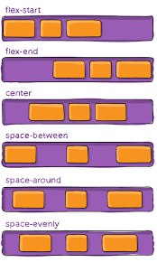

# Flexbox 

Mit Flexbox können wir unkompliziert variable und responsive Layouts erzeugen. Das Modell arbeitet mit zwei Achsen (horizontale und vertikale) auf denen Inhalte verteilt werden können.

 

### **Elternteil ist unser flex-container, in welchem wir mit folgenden properies bestimmen können, wie sich dessen Kinder (boxen / flex-items) verhalten sollen**

```css
.flex-container{
    display:flex;
    flex-direction: row (default) |row-reverse | column | column-reverse;
    justify-content:flex-start (default) | flex-end | center | space-between | space-around | space-evenly | start | end;
    align-items:stretch (default) | flex-start | flex-end | center | baseline;
    flex-wrap: nowrap | wrap | wrap-reverse
}
```
---
### **flex-direction**
 

---

### **Ausrichtung auf den x/y Achsen**
**`bei flex-direction:row mit:`**


<div>

```css
justify-content:(richtet die Kinder auf der x-Achse aus => Bild 1)
```
```css
align-items:(richtet die Kinder auf der y-Achse aus => Bild 2)
```
</div>


<div>

 
<span> <-- x</span>


 
<span> <-- y</span>

</div>


---
**:exclamation::exclamation::exclamation: ACHTUNG VORSICHT bei `flex-direction:column` drehen sich die Befehle für die Ausrichtung um. Dort übernimmt:**\
 `justify-content` die y-Achse und
  `align-items` die x-Achse.

---
### **flex-wrap**

 

Der `default` Wert ist `no-wrap`, das heißt, das alle Kinder des flex-containers bei `direction:row` z.b. in eine Reihe gequetscht werden und dabei unter Umständen ihre Orginalbreite verlieren können, um das zu verhinden, können wir dem Elternelement sagen 
```css 
 flex-wrap:wrap
 ```

---       

 **mehr Lesematerial**

:point_right:[flexbox-aligning with auto margins](https://dev.to/samanthaming/flexbox-aligning-with-auto-margins-4gfh)\
:point_right:[flexbox tutorial](https://marina-ferreira.github.io/tutorials/css/flexbox/)\
:point_right:[flexbox tutorial](https://css-tricks.com/snippets/css/a-guide-to-flexbox/)

 **CSS Game**

:point_right:[css flexbox game froggy](https://flexboxfroggy.com/)
