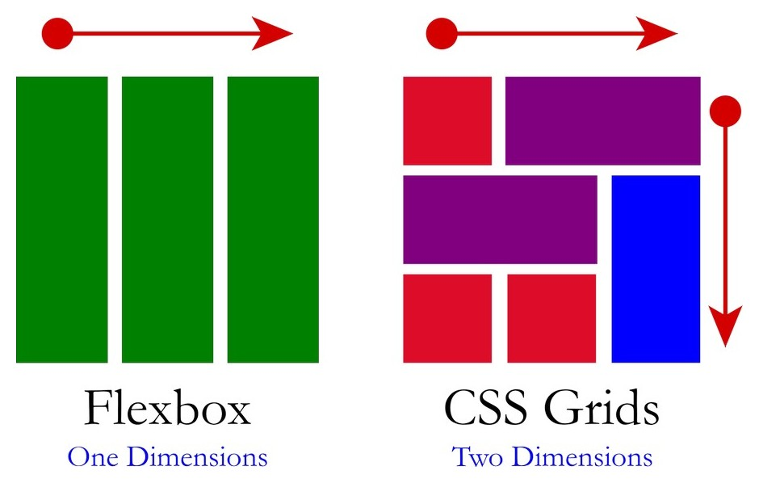
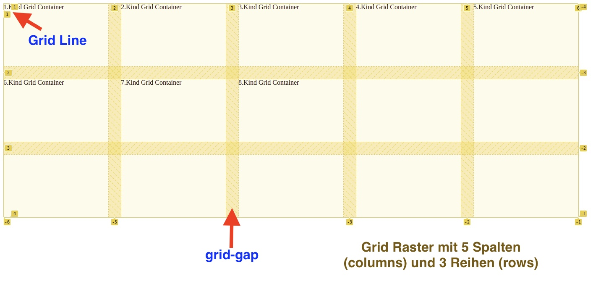
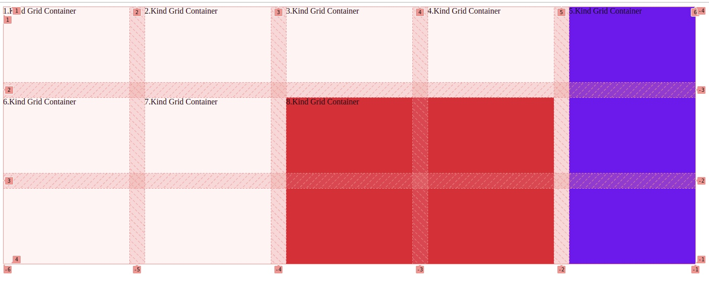

# Grid

Ein CSS Grid Layout bietet dem Webdesigner zwei Dimensionen zur Platzierung der Objekte. Statt nur auf einer Achse kann man mit CSS Grid ein Raster mit Zeilen und Spalten verwenden.



---
## Grundlage: Grid, Columns und Rows festlegen

```html
    <div class="container">
        <div id="one">1.Kind Grid Container</div>
        <div id="two">2.Kind Grid Container</div>
        <div id="three">3.Kind Grid Container</div>
        <div id="four">4.Kind Grid Container</div>
        <div id="five">5.Kind Grid Container</div>
        <div id="six">6.Kind Grid Container</div>
        <div id="seven">7.Kind Grid Container</div>
        <div id="eight">8.Kind Grid Container</div>
    </div>
```

Im CSS wandeln wir die Klasse `.container` ganz einfach in ein Grid, indem wir `display:grid` hinzufügen. Mit `grid-template-columns` aktivieren wir die gewünschten Spalten, in diesem Fall 5 Spalten mit je 250px und mit `grid-template-rows` können wir die Höhe der Zeile einstellen, in diesem Fall 150px. Und das war’s, unser Raster ist fertig!

```css
.container{
    display: grid;
    grid-template-columns: repeat(5, 250px);
    grid-template-rows:repeat(3, 150px);
    grid-gap: 30px;
}
```



---


Auf unserem erstellten Grid Raster (5 Spalten und 3 Zeilen) können wir nun mit Hilfe der Grid Linien unsere Kinder innerhalb des Containers plazieren.


```css
#five{
    grid-column: 5/6;
    grid-row: 1/4;
    background-color: blue;
}

#eight{
    grid-column: 3 /span 2;
    grid-row: 2/ span 2;
    background-color: crimson;
}
```




 **mehr Lesematerial**

:point_right:[grid cheatsheet](https://grid.malven.co/)\
:point_right:[learn css grid](https://learncssgrid.com/#grid-container)\
:point_right:[lerne css grid (deutsch)](https://kulturbanause.de/blog/css-grid-layout-module/)\
:point_right:[grid in 5 Minuten verstehen (deutsch)](https://medium.com/sketch-app-sources/css-grid-einf%C3%BChrung-in-5-minuten-verstehen-und-in-sketch-umsetzen-9e9e8a16b07e)\
:point_right:[practice grid mit Freecodecamp](https://www.freecodecamp.org/learn/responsive-web-design/css-grid/create-your-first-css-grid)\
:point_right:[grid by example](https://gridbyexample.com/examples/)\
:point_right:[grid-auto-fill-vs-auto-fit](https://css-tricks.com/auto-sizing-columns-css-grid-auto-fill-vs-auto-fit/)\
:point_right:[flexbox vs grid](https://blog.logrocket.com/flexbox-vs-css-grid/)


 **CSS Game**

:point_right:[css grid game (grid-garden)](https://cssgridgarden.com/)


