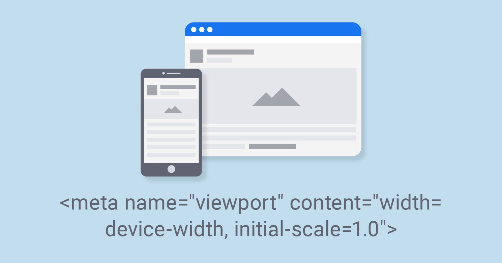
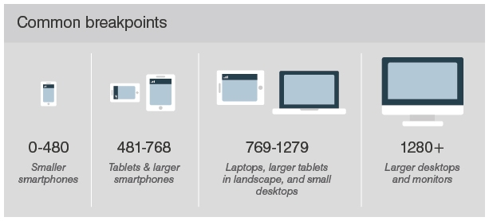

# media queries

Für die Darstellung auf Mobilgeräten nutzen wir das viewport Meta-Tag (auf Deutsch Ansichtsfenster oder Anzeigebereich). Es sorgt für eine korrekte Skalierung der Webseite beim Aufruf auf einem mobilen Gerät.

 

---

### Mobile First - min-width media queries

Eine “Mobile-first”-Herangehensweise bezeichnet beim Entwurf einer Website mit der mobilen Version zu starten, die dann an größere Bildschirme angepasst wird. Für "mobile-first" nutzen wir `min-width` media queries.

```css
html { background: red; }

@media (min-width: 600px) {
  html { background: green; }
}
```

### Desktop First - max-width media queries

Der Ansatz „Desktop First“ bedeutet, zuerst die Desktop-Version einer Website zu entwerfen und ausgehend davon Konzepte für kleinere Bildschirme abzuleiten. Für "desktop-first" nutzen wir `max-width` media queries.

```css
html { background: red; }

@media (max-width: 600px) {
  html { background: green; }
}
```
---
### Breakpoints Orientierung

 

---

 **mehr Lesematerial**

:point_right:[seo Artikel viewport](https://www.seobility.net/de/wiki/Viewport)\
:point_right:[mdn media queries](https://developer.mozilla.org/en-US/docs/Learn/CSS/CSS_layout/Media_queries)\
:point_right:[css tricks media queries](https://css-tricks.com/logic-in-media-queries/)


