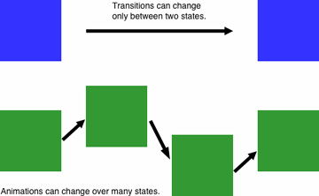
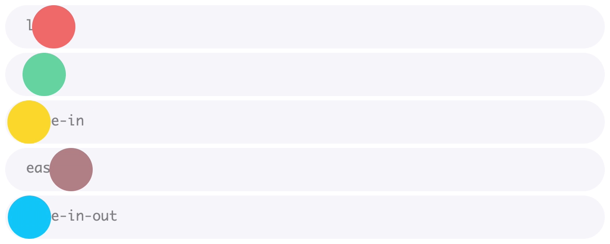

# Animation

### Transition vs Animation

Transition werden benutzt, zum Erstellen eines reibungslosen Übergangs von einem Zustand in einen anderen. Animationen für komplexere Bewegungsfolgen.

 

---

### Transition

Transitions müssen immer getriggert werden (bspw. durch ein hover):

Die CSS Eigenschaft `transition` ist die shorthand property für `transition-property`, `transition-duration`, `transition-timing-function` und `transition-delay`.

```css
div {
  background-color:green;
  transition: background-color, transform 4s ease-in-out 1s
}

div:hover {
  background-color:red;
  transform:rotate(180deg);
}
```
Beim hovern des elementes wird Hintergrundfarbe geändert und es wird um 180 Grad gedreht, Es wird mit 1s Verspätung und einer Dauer von 4s und  einer ease-in-out Geschwindigkeitskurve in den nächsten Zustand transformiert. 

- `transition-property` : legt fest, welche Eigenschaften verändert werden sollen. 
- `transition-duration` : Zeitangabe in Sekunden(s) oder Millisekunden(ms).
- `transition-timing-function` : definiert die Geschwindigkeitskurve des Transitions-Übergangs
- `transition-delay` : legt fest, mit welcher Verzögerung der Übergang ausgelöst werden soll. 

**transition-timing-function**
`linear`ist default

 

**transition-timing-function steps() und cubic-bezier**

- `steps(nr, [start|end])` benötigt immer zwei Parameter, bestimmt keinen fließenden, sondern einen schrittweisen Übergang
- `cubic-bezier(x1, y1, x2, y2)` steuert die Transition nach eigenen Angaben. Die ersten zwei Werte bestimmen die Startgeschwindigkeit, der dritte und vierte Wert die Endgeschwindigkeit. Der Geschwindigkeitsverlauf ergibt sich aus der Kurve, welche Start- und Endpunkt verbindet. Alle vier Parameter sind Pflichtparameter

--- 
### Animation

Anders als bei transition können wir hier mehrstufige Animationen festlegen. In einer @keyframes-Regel können wir die Wegpunkte für den Ablauf der Animation setzen, die dann von der Eigenschaft animation aufgerufen werden. 

```css
@keyframes beispiel {
0% {
    background-color:green
 }
50% {
    background-color:blue
 }
100% {
    background-color:red
  }
}
```
Hier wechselt die Farbe auch von grün auf rot, jedoch mit einem Zwischenstop über blau.

```css
.element{ 
    animation: name(z.b. beispiel) duration timing-function delay iteration-count direction fill-mode play-state; 
}
```
Zusätzlich zu den Eigenschaften der transition `transition-duration`, `transition-timing-function` und `transition-delay`, können wir bei der animation noch den `animation-iteration-count`, die `animation-direction`, den `animation-fill-mode`, sowie den `animation-play-state` bestimmen.

- `animation-iteration-count`: legt fest, wie oft die Animation wiederholt werden soll.
    * `numerische Zahl` (Standardwert ist 1)
    * `infinite` Endlosschleife 

- `animation-direction` :legt fest, welchen Verlauf die Animation nehmen soll. 
    * `normal`(Standardwert), 
    * `reverse`, 
    * `alternate` und 
    * `alternate-reverse`

- `animation-fill-mode` :legt fest, welchen Zustand das animierte Element nach Beendigung der Animation haben soll.
    * `none`: (Standardwert)
    * `forwards` Der Endzustand wird weiterhin angezeigt
    * `backwards` Das Element springt nach Beenden der Animation zum Anfangszustand zurück
    * `both` Das Element übernimmt sowohl die Regeln die am Anfang der Animation definiert wurden, als auch die am Ende


- `animation-play-state` :legt fest, ob Animation läuft oder pauserien soll. 
    * `running`
    * `paused` Animation ist gestoppt
    Die Animation ist gestoppt, kann aber z.B. durch JavaScript aktiviert werden, indem der Wert auf running gesetzt wird.

 **Tools**

:point_right:[Animsta](https://animista.net/)\
:point_right:[freie Animationen (lottiefiles)](https://lottiefiles.com/featured)\
:point_right:[clippy](https://bennettfeely.com/clippy/)\
:point_right:[animated loading spinner](https://loading.io/css/)\
:point_right:[CSS Animations Generator](https://www.theappguruz.com/tag-tools/web/CSSAnimations/)


**mehr Lesematerial**

:point_right:[Vergleich der animation-timing-functions](https://codepen.io/northernlights3/pen/yLebRKZ)\
:point_right:[W3schools animation](https://www.w3schools.com/css/css3_animations.asp)\
:point_right:[mdn transitions](https://developer.mozilla.org/en-US/docs/Web/CSS/CSS_Transitions/Using_CSS_transitions)\
:point_right:[animation cheat-sheet](https://learn-the-web.algonquindesign.ca/topics/css-animations-effects-cheat-sheet/)\
:point_right:[css clipping mit clip-path](https://www.digitalocean.com/community/tutorials/css-clipping-with-clip-path)\
:point_right:[animation mit clip-path](https://css-tricks.com/animating-with-clip-path/)\
:point_right:[css-animation-libraries](https://css-tricks.com/css-animation-libraries/)\
:point_right:[transition vs animation](https://blog.hubspot.com/website/css-transition-vs-animation)\
:point_right:[selfhtml Animationen](https://wiki.selfhtml.org/wiki/CSS/Tutorials/Animation/Animation)


**Youtube Videos**

:point_right:[css King zu transitions](https://www.youtube.com/watch?v=Nloq6uzF8RQ)\
:point_right:[Traversy Media animations & transitions](https://www.youtube.com/watch?v=zHUpx90NerM&t=130s)


