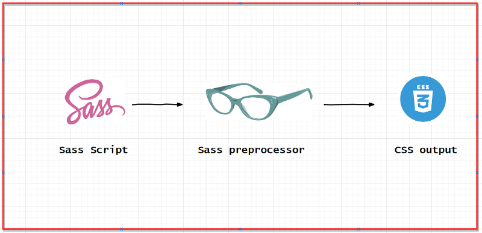
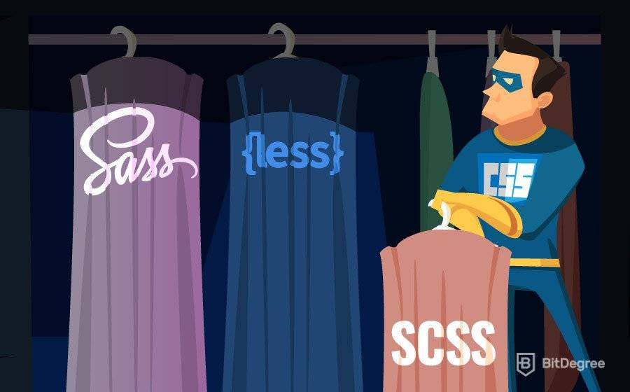
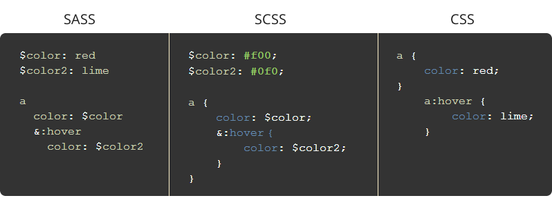

# SASS

### Was ist Sass?

- Sass steht für Syntactically Awesome Stylesheet
- Sass ist eine Erweiterung von CSS
- Sass ist ein css pre-processor
- Sass ist vollständig kompatibel mit allen CSS-Versionen
- Sass reduziert Wiederholungen von CSS und spart somit Zeit
- Sass kann kostenlos heruntergeladen und verwendet werden

 

### Warum Sass verwenden?

Stylesheets werden immer größer, komplexer und schwieriger zu pflegen. Hier kann ein css-pre-processor helfen.

Mit Sass können wir Features verwenden, die in CSS nicht existieren, wie z.b. Variablen, nesting, mixins, imports, Extend/Inheritance und built-in functions.

 

### SASS vs SCSS

**SASS hat zwei Schreibweisen.** 

- Die am häufigsten verwendete Syntax ist als „SCSS“ (für „Sassy CSS“) bekannt. SCSS-Dateien verwenden die Dateiendung .scss.

- Die ältere Syntax ist als SASS bekannt. SASS kommt ohne geschweifte Klammern und Semikolons aus. Es werden Einrückungen von Zeilen verwendet, um Blöcke anzugeben. Dateien in der eingerückten Syntax verwenden die Erweiterung .sass.

 --------------- SASS --------------- | --------------- SCSS --------------- | --------------- CSS ---------------
--- | --- | ---

 

 **mehr Lesematerial**

:point_right:[sass documentation](https://sass-lang.com/)\
:point_right:[scss cheatsheet](https://devhints.io/sass)\
:point_right:[scss best practices](https://www.educative.io/blog/sass-best-practices-frontend-coding-tips)\
:point_right:[complete scss guide in examples](https://medium.com/litslink/sass-in-examples-5fb9b205c3a8)\
:point_right:[scss guide](https://blog.logrocket.com/the-definitive-guide-to-scss/)\
:point_right:[difference scss und sass](https://sodocumentation.net/sass/topic/2428/scss-vs-sass)

