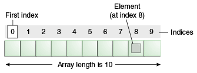
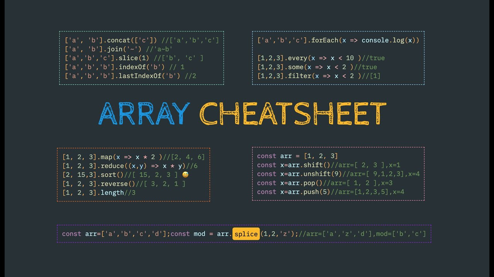

# Array

Ein Javascript Array ist eine Datenstruktur, die mehrere Werte unter einem gemeinsamen Namen speichert. Diese müssen in JavaScript nicht vom gleichen Typ sein. Die Reihenfolge der hinterlegten Daten wird durch deren Position im Array bestimmt. Auf die einzelnen Werte können wir mit dem Index zugegreifen. Arrays, sind listenähnliche Objekte sind.


:heavy_exclamation_mark::heavy_exclamation_mark::heavy_exclamation_mark: 
## length vs index



---

## Zugriff auf ein Arrayelement (mit Index)

```
const fruits = ['Apple', 'Banana'];

const first = fruits[0];
// Apple

const last = fruits[fruits.length - 1];
// Banana
```

## Array methods

Javascript Array-Methoden sind vorfertigte Funktionen, die etwas mit dem Array machen



## slice vs splice

### `slice()` kopiert einen Teil des Arrays und returns den kopierten Teil als ein neues Array. Das Orginal Array wird nicht verändert.

`array.slice(from, until)` :heavy_exclamation_mark: das letzte Element wird jedoch inkludiert, schneide ab vor element (until)

```
let array = [1, 2, 3, "Hello World", 4, 12, true]
let newArray = array.slice(1,3)

newArray
> [1,2,3]
array
> [1, 2, 3, "Hello World", 4, 12, true]
```

### `splice()` adds oder removes elemente vom Orginalarray. Wir veränderm das array.

`array.splice(index, number of elements)` von welchem index, wieviele Elemente?;

```
let array = [1, 2, 3, "Hello World", 4, 12, true]
array.splice(2, 1);
> [1, 2, "Hello World", 4, 12, true]
3 wird entfernt so “hello world” ist nun index 2
```
---

**mehr Lesematerial**

:point_right:[confusion-around-the-slice-splice-split-methods-in-javascript (engl.)](https://www.freecodecamp.org/news/lets-clear-up-the-confusion-around-the-slice-splice-split-methods-in-javascript-8ba3266c29ae/)\
:point_right:[w3schools javascript array methods](https://www.w3schools.com/js/js_array_methods.asp)\


