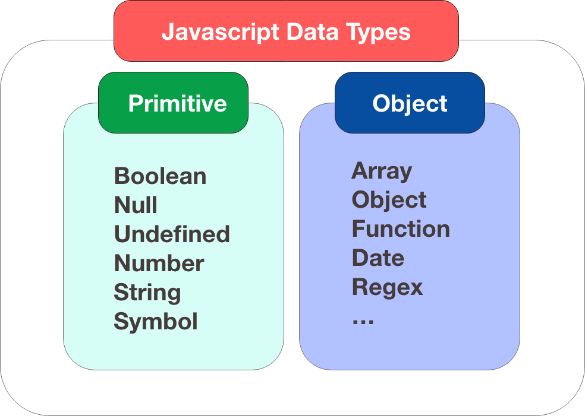

# Primitives



**In JavaScript kannst du, abgesehen von Objekten, 6 verschiedene Arten von Werten nutzen, diese sind:**

- Boolean: `bool` (true oder false)
- Null: `null`
- Undefined: `undefined`
- Number: `number` (ganze Zahlen und Fließkommazahlen)
- String: `string`
- Symbol: `symbol` (neu in ECMAScript 6)

## Null vs. Undefined

Es liegt nahe zu denken das `null` und `undefined` das Gleiche sind, aber es gibt subtile Unterschiede:

`null` ist ein leerer, nicht existierender Wert, und kann einer Variable zugeordnet werden.

```js
let a = null;
// null
```

`undefined` ist der Wert einer Variable die deklariert, aber nicht definiert wurde.

```js
let b;
// undefined
```

## typeof Operator

Mit dem Operator typeof können wir den Variablentyp eines Ausdrucks ermitteln. 

```
typeof "John"                 // Returns string
typeof 3.14                   // Returns number
typeof NaN                    // Returns number
typeof false                  // Returns boolean
typeof [1,2,3,4]              // Returns object
typeof {name:'John', age:34}  // Returns object
typeof new Date()             // Returns object
typeof function () {}         // Returns function
typeof myCar                  // Returns undefined (if myCar is not declared)
typeof null                   // Returns object 
```

## Umwandlung von Datentypen

Bei der Initialisierung von Variablen mit einem Anfangswert nimmt die jeweilige Variable automatisch den Typ des Wertes an. Im Gegensatz zu vielen anderen Programmiersprachen, muss bei der Deklaration einer Variablen selbiger kein Datentyp zugewiesen werden. Die Variable bleibt auch nicht an einem Typ gebunden, sondern kann bei der Abarbeitung des Codes mit einem neuen Wert einen anderen Typ annehmen. Je nach Anforderungen kann ebenfalls der Wert erhalten bleiben und nur der Datentyp geändert werden.

**JavaScript stellt einige Funktionen zur Typumwandlung zur Verfügung**

- `Number()` um Strings in Zahlen zu konvertieren
- `String()` oder `x.toString()` können Zahlen in Strings konvertieren
- `parseFloat()` parst einen String und gibt eine Fliesskommazahl zurück
- `parseInt` parst einen String und gibt einen Integer zurück
- `Boolean()` übergibt man ihr einen der falsy-Werte, erhält man false, sonst true. 

:heavy_exclamation_mark::heavy_exclamation_mark::heavy_exclamation_mark: 

JavaScript ist eine dynamisch typisierte Sprache – das bedeutet, dass kein Datentyp bei der Deklaration einer Variablen angegeben wird und der Javascript-Interpreter während der Ausführung des Programms bei Bedarf Datentypen automatisch konvertiert.

```
let num = "42" + 2 // gibt 422 zurück
let num = "42" - 2 // gibt 40 zurück
```

Bei `„-“`, `„*“` und `„/“` wird die Zeichenkette in eine Zahl konvertiert.

Bei `"+“` wird aber die Zahl in eine Zeichenkette konvertiert, da das Pluszeichen in diesem Fall als Operator zum Zusammenfügen von Zeichenketten interpretiert wird. 

**mehr Lesematerial**

:point_right:[how to check the type of a variable or object (engl.)](https://www.freecodecamp.org/news/javascript-typeof-how-to-check-the-type-of-a-variable-or-object-in-js/)\
:point_right:[typeof Operator (deutsch)](https://wiki.selfhtml.org/wiki/JavaScript/Operatoren/typeof)\
:point_right:[primitives-methods](https://javascript.info/primitives-methods)\
:point_right:[understanding-js-primitives](https://codeburst.io/understanding-js-primitives-fafe16468c16)\
:point_right::fire:[javascript Datentypen und Umwandlung](http://www.coder-welten.de/javascript/datentypen-und-umwandlung-8.html)


 **Youtube Tutorial**

:point_right:[How to Check the Type of a Variable or Object in JS](https://www.youtube.com/watch?v=UAZRq7Ev5No)\
:point_right:[JavaScript - Reference vs Primitive Values/ Types](https://www.youtube.com/watch?v=9ooYYRLdg_g)


