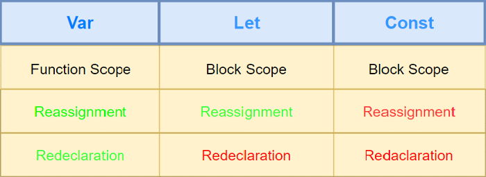

# Variables
Eine Variable besitzt ein Wert, den man festlegen kann um ihn öfter wiederzuverwenden, oder auszuwerten.

## Var, let oder const?

Der kurz zusammengefasste Unterschied zwischen den 3 Variablentypen:

| Typ     | Kann neu deklariert werden | Wert kann verändert werden |
| ------- | -------------------------- | -------------------------- |
| `var`   | JA                         | JA                         |
| `let`   | NEIN                       | JA                         |
| `const` | NEIN                       | NEIN                       |

---

## Gültigkeitsbereich (Scope) von Variablen

---
**mehr Lesematerial**

:point_right:[javascript-variables-best-practices (engl.)](https://dmitripavlutin.com/javascript-variables-best-practices/)
