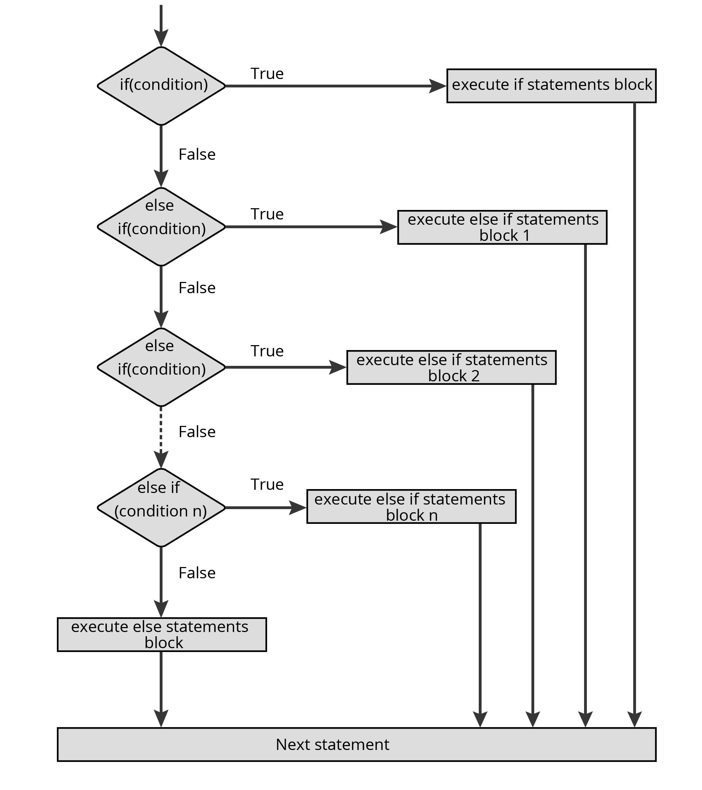

# Conditional Statements
Conditional Statments kontrollieren das Verhalten von Code in JavaScript, indem sie entscheiden ob Code ausgeführt wird oder nicht.

Es gibt gibt 3 verschiedene Arten von Conditional Statements in Javascript:

- `if`: Wenn die Kondition `true` ergibt, wird der Code innerhalb des "if-Blocks" ausgeführt.
- `else if`: Wenn auf eine weitere Kondition getestet wird, und die erste Kondition false ist, wird dieser block ausgeführt.
- `else`: Wenn die oben angegebene Kondition `false` ergibt wird der Code innerhalb des "else-Blocks" ausgeführt.



Beispiel:

```js
const testValue = 25;

// If-Statement:
if(testValue > 5)
{
    console.log(`${ testValue } ist größer als 5`);
}
// ergibt: 25 ist größer als 5

// Else-Statement:
if(testValue === 5)
{
    console.log(`${ testValue } ist gleich 5`);
}
else
{
    console.log(`${ testValue } ist nicht 5`);
}
// ergibt: 25 ist nicht 5

// Else-if Statement:
if(testValue === 5)
{
    console.log("testValue ist 5");
}
else if(testValue === 10)
{
    console.log("testValue ist 10");
}
else
{
    console.log("testValue ist eine andere Zahl");
}
// ergibt: testValue ist eine andere zahl
```

## Und, Oder in Conditional-Statements

Um mehrere Werte zu vergleichen, kann man einen Operator mit in seine if-clause einfügen.
- `||` Der oder Operator
- `&&` Der und Operator

---

## Ternary-Operator

Der Ternary-Operator ist die bedingte Zuweisung eines Werts an eine Variable. 
Wir verwenden diesen als kürzere Schreibweise einer einfachen if-else Bedingung. 

```javascript
const myVariable = condition? true : false
```

---

**mehr Lesematerial**

:point_right:[javascript.info if / else](https://javascript.info/ifelse)\
:point_right:[if -- else if // if-- else if -- else](https://www.javascript.com/learn/conditionals)\
:point_right:[javascript.info logical-operators](https://javascript.info/logical-operators)\
:point_right:[ternary-operator freecodecamp](https://www.freecodecamp.org/news/ternary-operator-javascript-if-statement-tutorial/)


