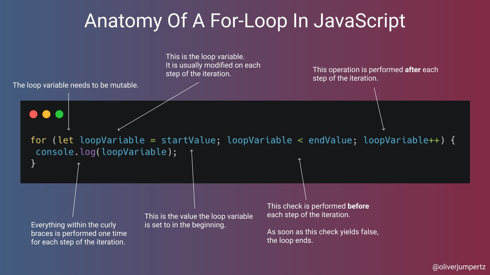
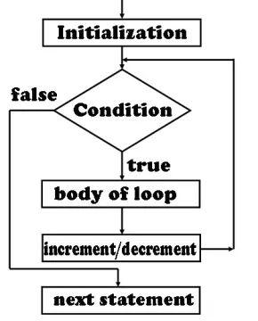
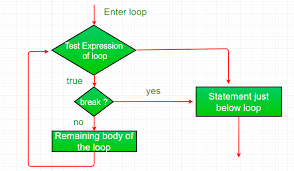
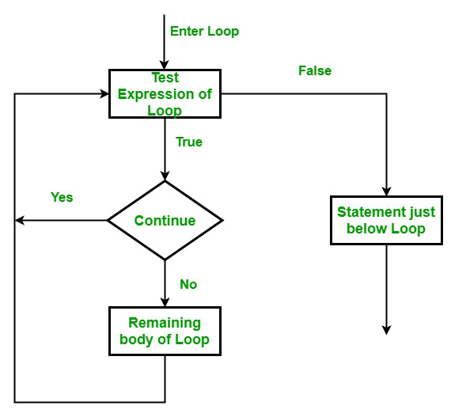

# Schleifen (engl. loops)

Eine Schleife (auch „Wiederholung“ oder englisch loop) ist eine Kontrollstruktur in Programmiersprachen. Sie wiederholt einen Anweisungs-Block, solange die Schleifenbedingung als Laufbedingung gültig ist. Schleifen, deren Schleifenbedingung immer zur Fortsetzung führt oder die keine Schleifenbedingung haben, sind Endlosschleifen. 

## for-loop

Der Schleifenkopf einer for-Schleife enthält eine Zählvariable, eine Fortführungsbedingung sowie eine Anweisung zur Änderung der Zählvariable. 





---

## break und continue

Bei der Kontrolle innerhalb von Schleifen helfen uns `break` und `continue`

- Mit `break` können wir eine Schleife sofort beenden, unabhängig von der Abbruchbedingung im Schleifenkopf.  



```javascript
for (let i = 1; i < 10; i++) {
    if (i % 3 == 0) {
        break;
    }
}
console.log(i); // 3
```

- Mit `continue` können wir die aktuelle Iteration beenden



```javascript
let s = 'This is a JavaScript continue statement demo.';
let counter = 0;
for (let i = 0; i < s.length; i++) {
    if (s.charAt(i) != 's') {
        continue;
    }
    //
    counter++;
}
console.log('The number of s found in the string is ' + counter);
```


**mehr Lesematerial**

:point_right:[freecodecamp loops](https://www.freecodecamp.org/news/javascript-loops-explained-for-loop-for/)\
:point_right:[javascripttutorial break](https://www.javascripttutorial.net/javascript-break/)\
:point_right:[javascripttutorial continue](https://www.javascripttutorial.net/javascript-continue/)


