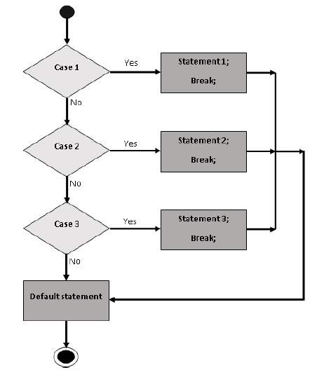

# Switches
Ein Switch kann mehrere blocks mit Code ausführen, und kann außerdem, wenn keine Kondition eintrifft, auf einen default code-block springen.



## Wozu dient break;?

Wenn ein `break;` Kommando erreicht wurde, verlässt JavaScript den Switch und führt den Rest des Codes aus. Das letzte Switch-Statement benötigt kein `break;` Kommando, da danach ohnehin der Switch verlassen wird.

## Wie vergleicht ein switch?

Switches vergleichen Werte in strikter Form, also in Form des `===`:

Beispiel:
```js
const testValue = "0";

switch (testValue) {
  case 0:
    console.log("Off");
    break;
  case 1:
    console.log("On");
    break;
  default:
    console.log("No value found");
}
// ergibt: "No Value Found";
```

**mehr Lesematerial**

:point_right:[w3schools switch](https://www.w3schools.com/js/js_switch.asp)\
:point_right:[javascript.info switch](https://javascript.info/switch)\
:point_right:[switch vs if else](https://www.geeksforgeeks.org/switch-vs-else/)


