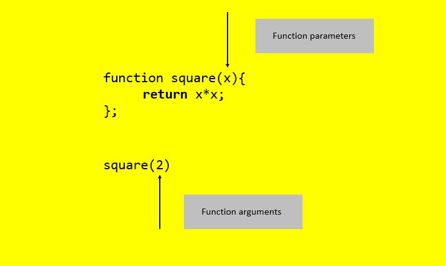
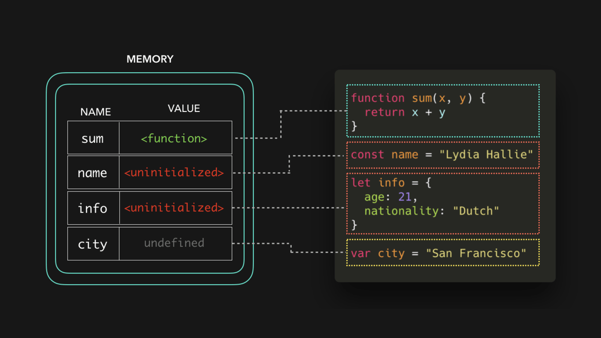

# Functions

Funktionen sind die wichtigsten „Bausteine“ des Programms. In einer Programmiersprache ohne Funktionen müssten Anweisungen zigfach wiederholt werden. 


Funktionen verfügen über Parameter, darunter versteht man eine Liste von Variablennamen, die während der Ausführung wie lokale Variablen zur Verfügung stehen und deren Werte – Argumente genannt – vom Aufrufer bereitgestellt werden. 



Funktionen geben immer einen Wert zurück. Wenn wir keinen return Wert angegeben, gibt die Funktion undefined zurück. Eine weitere wichtige Regel der return-Anweisung ist, dass sie die Funktionsausführung sofort stoppt und einen Wert an den Funktionsaufrufer zurück gibt.

---

## **verschiedene Funktionsschreibweisen und Hoisting <sub>[go to Hoisting here](#contents)</sub>**

- ## als  function declaration

```javascript
function name(parameters){
  statements
}
```
Bei der Verwendung von function declarations wird die Funktionsdefinition "hochgehoben" (engl. hoisted), sodass die Funktion verwendet werden kann, bevor sie definiert wird.

- Beispiel 

```javascript
let x = 20,
    y = 10;

let result = add(x,y);
console.log(result);

function add(a, b){
return a + b;
}
```
---
- ## als function expression

```javascript
let name = function(parameters){
  statements
}
```
```
let name = (parameters) => {
  statements
}
```
Ein Funktionsausdruck (engl. function expression) definiert eine benannte oder anonyme Funktion. Eine anonyme Funktion ist eine Funktion ohne Namen. Funktionsausdrücke werden nicht "hochgehoben" (engl. hoisted) und können daher nicht verwendet werden, bevor sie definiert wurden.
Es wird nur die Variable "hochgehoben" (hoisted). Die Funktion wird der Variable erst zugewiesen, wenn die betreffende Codezeile ausgeführt wird.

```javascript
let x = 20,
    y = 10;

let result = add(x,y);
console.log(result);

var add = function(x, y) {
return x + y;
}
```
wenn der Code ausgeführt wird, bekommen wir folgenden Error
```javascript
"TypeError: add is not a function"
```
---
<div id="#contents"></div>
## Hoisting 



Wenn der JS-Engine unser Skript erhält, richtet er als erstes Speicher für die Daten in unserem Code ein. Zu diesem Zeitpunkt wird kein Code ausgeführt, es wird einfach alles für die Ausführung vorbereitet. 

Konzeptionell wird Hoisting auch oft als der Interpreter dargestellt, der "Variablendeklaration `let counter;` und Initialisierung `counter = 1;` aufteilt und (nur) die Deklarationen an den Anfang des Codes verschiebt". Dadurch können Variablen im Code erscheinen, bevor sie definiert werden. Zu beachten ist jedoch, dass eine Variableninitialisierung im ursprünglichen Code erst erfolgt, wenn die Codezeile ausgeführt wird.

```javascript
console.log(counter);
let counter = 1;
```
The JavaScript issues the following error:
```javascript
"ReferenceError: Cannot access 'counter' before initialization"
```


---
**mehr Lesematerial**

:point_right:[functions-understanding-the-basics](https://codeburst.io/javascript-functions-understanding-the-basics-207dbf42ed99)\
:point_right:[javascript-return-multiple-valuesh](https://www.javascripttutorial.net/javascript-return-multiple-values/)\
:point_right:[javascript-visualized-hoisting](https://dev.to/lydiahallie/javascript-visualized-hoisting-478h)\
:point_right:[javascript-hoisting](https://www.javascripttutorial.net/javascript-hoisting/)


