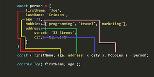

# Destrukturierung

Die beiden am häufigsten verwendeten Datenstrukturen in JavaScript sind Objekte und Arrays.
Unter einer Variable werden in einem Objekt, mehrere Eigenschaften mit ihren Werten zugewiesen. Und ein Array ermöglicht, in einer Variable Datenelemente in einer geordneten Liste zusammenzufassen.

Wenn wir Objekte oder Arrays an eine Funktion übergeben, benötigt diese möglicherweise kein Objekt/Array als Ganzes, sondern nur einzelne Stücke. 

Die destrukturierende Zuweisung ermöglicht es, Daten aus Arrays oder Objekten zu extrahieren und sie in neue eindeutige Variablen zu setzen. Die Destrukturierung ermöglicht es uns, mehrere Eigenschaften oder Elemente gleichzeitig aus einem Array/ Objekt zu extrahieren. Wir verwenden eine Syntax, die Array- oder Objektliteralen ähnelt.

---

**Beispiel Array:**

## ohne Destrukturierung

```javascript
const someArray = [1,2,3]
const first = someArray[0];
const second = someArray[1];
const third = someArray[2];
```
## mit Destrukturierung

```javascript
const [first, second, third] = someArray;
```
---

**Beispiel Objekt:**

## ohne Destrukturierung

```javascript
var hero = {
  name: 'Batman',
  realName: 'Bruce Wayne'
};
var name     = hero.name;
var realName = hero.realName;
name;     // => 'Batman',
realName; // => 'Bruce Wayne'
```

## mit Destrukturierung

```javascript
const hero = {
  name: 'Batman',
  realName: 'Bruce Wayne'
};
const { name, realName } = hero;
name;     // => 'Batman',
realName; // => 'Bruce Wayne'
```
---

Die keywords let oder const sind in der Syntax der Objektdestrukturierung von Bedeutung:exclamation:
Wenn wir die Variable im Voraus deklarieren und dann versuchen, den Schlüssel desselben Namens aus dem Objekt zu destrukturieren, bekommen wir einen Fehler. 
Die korrekte Syntax hierfür, ist den Destrukturierungsausdruck in Klammern ((...)) zu setzen.

```javascript
const hero = { 
    name: 'Batman',
}

const name;
{ name  } = hero; // Uncaught SyntaxError: Unexpected token '='
({ name  } = hero);

console.log(name); // => 'Batman
```





---

**mehr Lesematerial**


:point_right:[es6-in-depth-destructuring](https://hacks.mozilla.org/2015/05/es6-in-depth-destructuring/)\
:point_right:[jeffdevslife es6-destructuring-array-and-object](es6-destructuring-array-and-object/)\
:point_right:[javascript-object-destructuring-spread-operator-rest-parameter](https://www.freecodecamp.org/news/javascript-object-destructuring-spread-operator-rest-parameter/)


