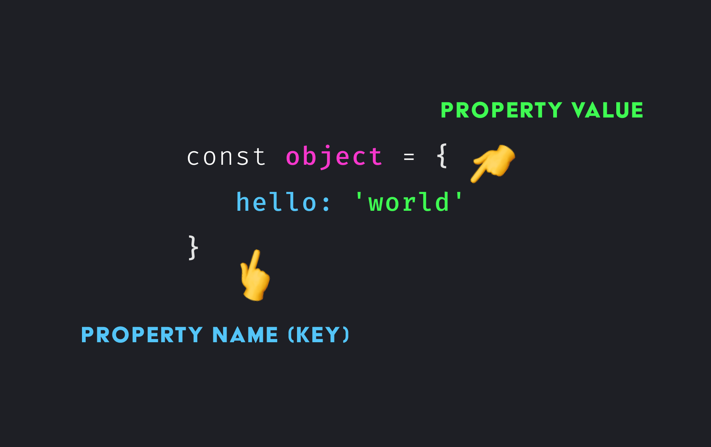

# objects

Objekte sind Behälter für logisch zusammen gehörende Variablen und Funktionen, die als Eigenschaften und Methoden des Objekts bezeichnet werden. Ein Javascript Object organisiert Daten, kapselt Daten und Logik nach außen ab und bietet eine einfache Schnittstelle zu seinen Elementen über seinen Namen. 




---

## auf Objekteigenschaften zugreifen

```javascript
object.hello; //dot notation
object["hello"]; //Array-like notation
```
---
## Variablen als Eigenschaften hinzufügen

```javascript
const variable = "some value"
objekt[variable]//mit Quotes würde JS nach einer Eigenschaft im Objekt suchen, welche variable heißt
```
---
## delete operator - um Eigenschaften eines Objektes zu löschen

```javascript
delete object.property;
```
---
## in Methoden nutzen wir das `this` keyword um auf Eigenschaften innerhalb des Objektes zuzugreifen

```javascript
method(){
    return `${this.key}`
}
```
---
## mit for...in können wir über die Eigenschaften eines Objektes iterieren

```javascript
for (const key in object) {
    console.log(key, object[key]);//hello, world
}
```
---
## prüfen ob Objekt eine bestimmte Eigenschaft hat


```javascript
console.log('name' in object);//false
console.log('hello' in object);//true
```
---
## Object.freeze vs Object.seal


---

## Objekt in Array umwandeln, um Array Methoden zu nutzen


---

**mehr Lesematerial**


:point_right:[javascripttutorial objects](https://www.javascripttutorial.net/javascript-objects/)\
:point_right:[js objects cheatsheet](https://www.codecademy.com/learn/introduction-to-javascript/modules/learn-javascript-objects/cheatsheet)\
:point_right:[object-property-shorthand-es6](https://alligator.io/js/object-property-shorthand-es6/)\
:point_right:[javascript.info/object-copy](https://javascript.info/object-copy)\
:point_right:[how-to-use-object-methods-in-javascript](https://www.digitalocean.com/community/tutorials/how-to-use-object-methods-in-javascript)


