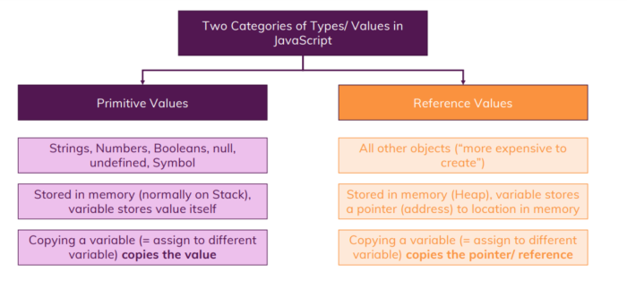
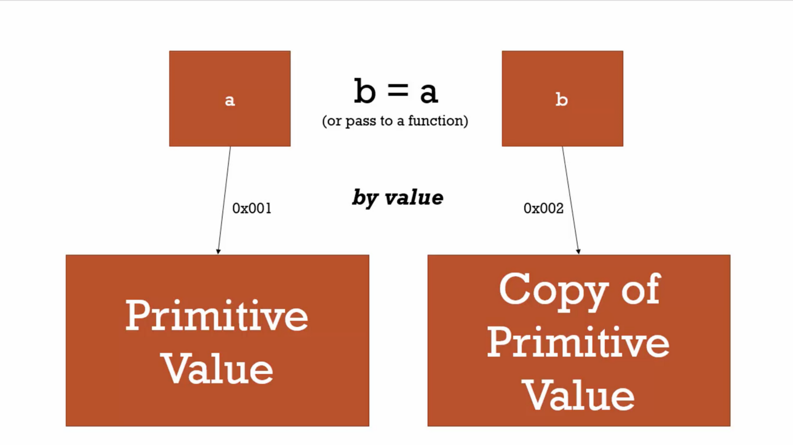
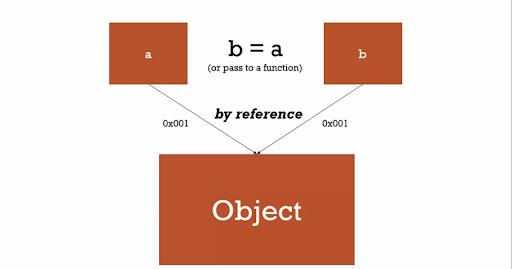
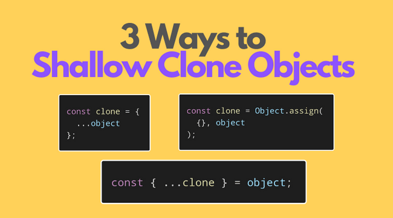

# value vs reference



Beim Programmieren gibt es zwei Möglichkeiten, Dinge zu übergeben oder zu kopieren. Das eine ist nach Wert und das andere nach Referenz.





:exclamation::exclamation::exclamation:

Alle Objekte werden als Verweis auf ihren Wert übergeben. Diese Referenz verweist auf die Position des Objekts im Speicher. Die Variablen enthalten nicht den Wert. Wenn wir sie also aktualisieren, nachdem wir sie mit einer anderen Variable gleichgesetzt oder an eine Funktion übergeben haben, zeigen sie alle auf denselben Wert, was manchmal zu Fehlern führen kann.

---

## shallow clone objects



Beispiel: `Object.assign()`

```javascript
const person = {
  name: 'john',
  age: 35,
  interests: { javascript: true }
};
const clone = Object.assign({}, person);
console.log(clone);
// { name: 'john', age: 35, interests: { javascript: true } }
```
---

## shallow clone vs deep clone

```javascript
person.name = 'jane';
person.age = 40;
person.interests.javascript = false;
console.log(person);
// { name: 'jane', age: 40, interests: { javascript: false } }
console.log(clone);
// { name: 'john', age: 35, interests: { javascript: false } }
```

Bei einem shallow clone können wir den ersten Layer des Objektes verändern, ohne das Orginal zu verändern. (es wird neuer Speicherplatz zugewiesen) Hat das Orginal jedoch genestete Arrays oder Objekte so wurden diese auch wieder nur per Referenz Pointer zur Speicheradresse kopiert, daher werden hier, bei einer Änderung, sowohl das Orginal, als auch die Kopie betroffen. :exclamation:


Um dieses Problem zu lösen, muss ein deep clone anstelle eines shallow clones durchgeführt werden.

:point_right:[methods-for-deep-cloning-objects-in-javascript](https://blog.logrocket.com/methods-for-deep-cloning-objects-in-javascript/)

---

**mehr Lesematerial**


:point_right:[object references and copying](https://javascript.info/object-copy#:~:text=One%20of%20the%20fundamental%20differences,%E2%80%9Cas%20a%20whole%20value%E2%80%9D.)\
:exclamation:[javascripttutorial.net/javascript-pass-by-value](https://www.javascripttutorial.net/javascript-pass-by-value/)\
:point_right:[javascript-deep-cloning-and-value-vs-reference](https://medium.com/irrelevant-code/javascript-deep-cloning-and-value-vs-reference-5bf09bf980d6)\
:exclamation:[methods-for-deep-cloning-objects-in-javascript](https://blog.logrocket.com/methods-for-deep-cloning-objects-in-javascript/)


**Youtube Videos**

:point_right:[Reference Vs Value In JavaScript](https://www.youtube.com/watch?v=-hBJz2PPIVE)
