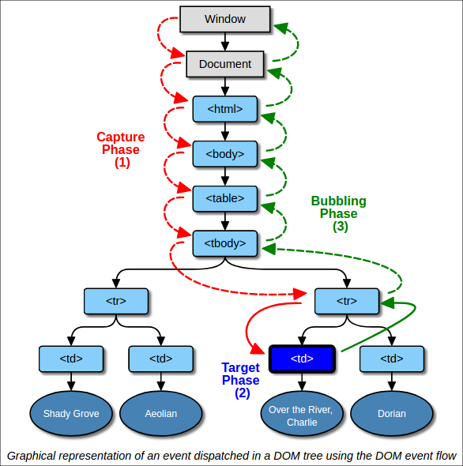
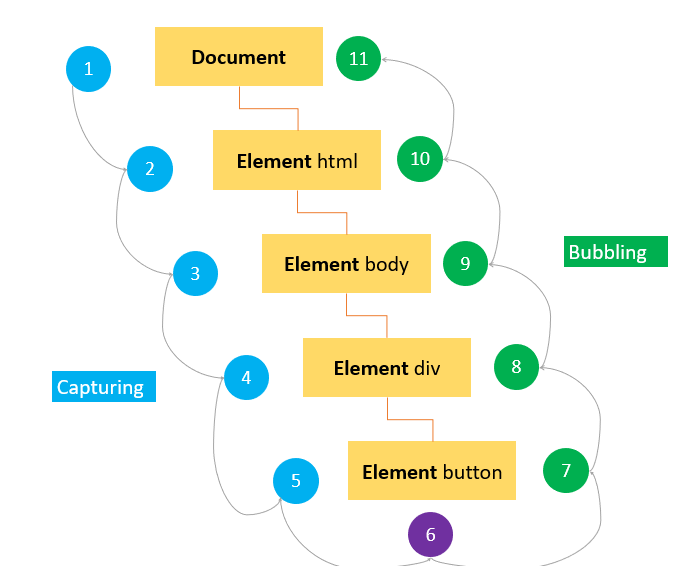
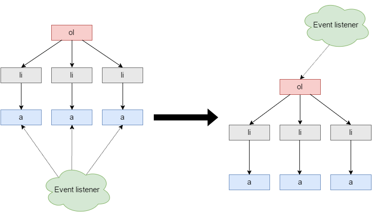

# Events

## addEventListener()

Mit einem Event Handler können wir genau steuern, was im Programm geschehen soll, wenn ein bestimmtes Ereignis eintritt.

- der erste Parameter ist das event auf welches gehört werden soll
- der zweite Parameter, ist die Funktion die immer dann ausgeführt wird, wenn das jeweilige Ereignis beim jeweiligen Element eintritt


```html
<a id ="my-link" href="www.google.com">google</a>
```

```javascript
const link = document.querySelector('#my-link')
link.addEventListener('click', handleClick) 

function handleClick(event){
  event.preventDefault()
  console.log(event.target);//=> <a id ="my-link" href="www.google.com">google</a>
  console.log(event.id);//=> my-link
  console.log(event.target.innerText)//=> google
}
```

In dieser Handler-Funktion ist es meistens nötig, auf die näheren Umstände des Ereignisses zu reagieren. Bspw. sind bei einem Mausklick die Koordinaten des Mauszeigers interessant oder bei einem Tastendruck die gedrückte Taste.

All diese Informationen sind im Event-Objekt gespeichert. (dieses wird standardmäßig als erster Parameter an die Handler-Funktion übergeben) Dieses Objekt repräsentiert das individuelle Ereignis, das der Handler gerade verarbeitet. Es bietet zahlreiche Eigenschaften mit Informationen zum Ereignis und einige Methoden, um das Verhalten des Ereignisses zu steuern.

## preventDefault()

Der Browser behandelt standardmäßig gewisse Ereignisse und führt die sogenannte Standardaktion (englisch default action) aus. Bspw. wenn wir ein Formular submitten, wird die Seite neu geladen oder wenn wir auf einen Link klicken, werden wir vom Browser zur angegebenen URL weitergeleitet. Mit `preventDefault()` können wir solche Standardereignisse unterbinden.

## removeEventListener()

mit dieser Methode können wir Ereignishandler wieder entfernen
(nur möglich, wenn die angegebene Handler-Funktion extern ist)

```javascript
link.removeEventListener('click', handleClick) 
```


---

# Event Flow

Bei einem Klick auf einem Button entsteht das Event nicht etwa auf dem Button, sondern Events entstehen immer auf dem window-Element und reisen dann durch den DOM-Tree nach unten (»Capturing Phase). Auf dem Weg nach unten informieren sie jedes HTML-Element: »Hi, hier ist ein Klick! Hast du auf mich gewartet?«.

Dann reist das Event in der Bubbling-Phase wieder nach oben bis zum ROOT. `event.stopPropagation()` verhindert die Weiterreise des Events. 

```javascript
event.eventPhase;
1=Capturing
2=Target
3=Bubbling
```




```javascript
<!DOCTYPE html>
<html>
<head>
    <title>JS Event Demo</title>
</head>
<body>
    <div id="container">
        <button id='btn'>Click Me!</button>
    </div>
</body>
```
Die Ereignisse werden im DOM-Tree weitergegeben Von oben nach durch `event-capturing` \
und von unten nach oben durch `event-bubbling`.

---
## Event Delegation

Bei der Event-Delegation (englisch delegation für Übertragung von Aufgaben) wird einem zentralen Element die Aufgabe übertragen, die Ereignisse zu verarbeiten, die bei seinen Nachfahrenelementen auftreten. Dafür nutzen wir die Verschachtelung im DOM-Tree, sowie das event-bubbling. Durch die Abfrage des event.targets im Event-Handler können wir das eigentliche target zurückverfolgen.

Event-Delegation eignet sich insbesondere dann, wenn viele gleichförmige Elemente in Menüs, Link-Listen, Formularen oder Tabellen JavaScript-Interaktivität benötigen. Ohne Event-Delegation müssten wir jedes Element einzeln ansprechen, um dort immer denselben Event-Handler registrieren.



Vorteile Event delegation: 
- dynamisch
- braucht weniger Speicherplatz -> bessere performance
---

**mehr Lesematerial**

:point_right:[javascripttutorial - javascript-mouse-events](https://www.javascripttutorial.net/javascript-dom/javascript-mouse-events/)\
:point_right:[MDN - Event](https://developer.mozilla.org/en-US/docs/Web/API/Event)\
:point_right:[W3schools - DOM Events](https://www.w3schools.com/jsref/dom_obj_event.asp)\
:point_right:[javascript.info - event-delegation](https://javascript.info/event-delegation)\
:point_right:[tutorialrepublic - event-propagation](https://www.tutorialrepublic.com/javascript-tutorial/javascript-event-propagation.php)


**Youtube Videos**

:point_right:[Web Dev Simplified - Event Listeners](https://www.youtube.com/watch?v=XF1_MlZ5l6M&t=74s)\
:point_right:[Wes Bos - JavaScript Event Capture, Propagation and Bubbling](https://www.youtube.com/watch?v=F1anRyL37lE)\
:point_right:[Zac Gordon - Event Propagation Explained (w Bubbling and Capturing)](https://www.youtube.com/watch?v=BtOrr7oTH_8)


