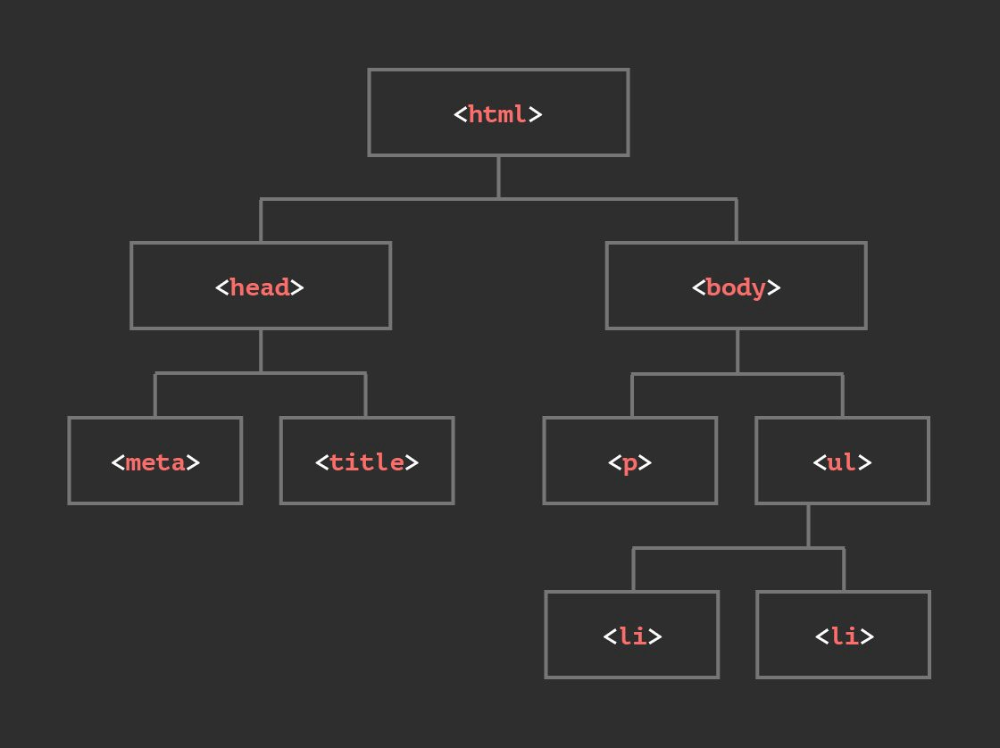

# DOM - Document Object Model

ist die Repräsentation eines HTML-Dokuments, das an den Browser ausgeliefert wird. Der Browser analysiert das HTML-Dokument und erstellt das Document Object Model. Auf dieses können wir dann mit JavaScript zugreifen.

---

## **wir können mit verschieden Methoden auf HTML Elemente der DOM zugreifen**

- `const element = document.getElementById('id')` \
gibt uns das HTML Element, mit der angegebenen ID zurück, (eine ID sollte eigentlich einzigartig sein, wenn jedoch mehrmals die gleiche ID vergeben wurde, bekommen wir nur das erste Element mit der angegebenen ID zurück)
wird keine passende ID im DOM gefunden, erhalten wir `null` zurück

- `const elementList = document.getElementsByTagName('tagName')`\
gibt uns eine Live-`HTML-Collection` von Elementen mit dem passenden Tag-Namen in der Reihenfolge zurück, in der sie im Dokument erscheinen. 

- `const elementList = document.getElementsByClassName('class')`;\
gibt uns eine Live-`HTML-Collection` von Elementen mit dem angegebenen Klassennamen zurück.

Elemente mit einem CSS Selector auswählen

- `const element = document.querySelector('a[target]')`;\
diese Methode akzeptiert ganze CSS Regeln. wir bekommen das erste `<a>` element mit einem `target` `attribute` hat
wenn kein passendes Element gefunden wird, gibt uns die Methode `null` zurück.

- `const elementList = document.querySelectorAll('p.example')`;\
gibt uns eine statische `NodeList` von Elementen zurück, die dem CSS-Selektor entsprechen. Wenn kein Element gefunden wird, wird eine leere NodeList zurückgegeben.

---

---
**mehr Lesematerial**

:point_right::fire:[mediaevent - NodeList / HTML-Collection](https://www.mediaevent.de/javascript/DOM-Nodes.html)\
:point_right:[javascripttutorial - selecting Elements](https://www.javascripttutorial.net/javascript-dom/javascript-getelementbyid/)

