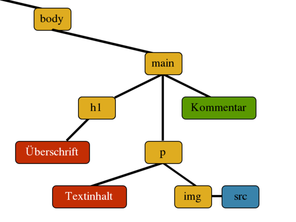

# Traversing the DOM

Die Node-Schnittstelle (node = Knoten) ist das zentrale Objekt des Document Object Models (DOM). Es repräsentiert einen einzelnen Knoten im Elementenbaum. 

Es gibt Eigenschaften, mit denen wir alle Nodes (Textknoten und Elementknoten) bekommen. Daneben existiert aber auch die Schnittstelle Element, welche uns nur die Elementknoten (HTML - Elemente) zurück gibt.

---
## vom "start Element" aus

`const start = document.querySelector('xxx')`

---

## Kinder 

**als Knoten (mit Text, Kommentaren etc.)**

`const alle Kinder = start.childNodes`

**alle Elemente (nur HTML – Elemente)**

`const alleHTMLKinder = start.children`

---

## Vorfahren nach bestimmten Suchkriterien (id, class, etc….) 

`const vorgänger = start.closest('CSS Selektor')`

---

## Eltern

**als Knoten (mit Text, Kommentaren etc.)**

`const eltern = start.parentNode`

**alle Elemente (nur HTML – Elemente)**

`const eltern = start.parentElement`

---

## Geschwister 

**als Knoten (mit Text, Kommentaren etc.)**

`const jüngere = start.previousSibling`

`const ältere = start.nextSibling`

**alle Elemente (nur HTML – Elemente)**

`const jüngere = start.previousElementSibling`

`const ältere = start.nextElementSibling`

---

