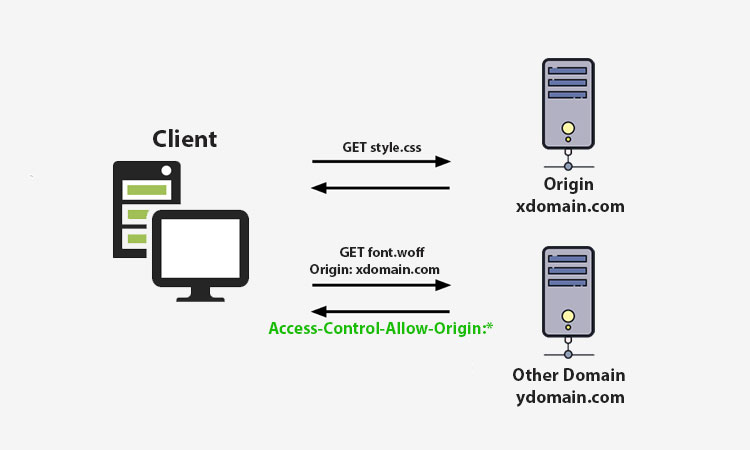
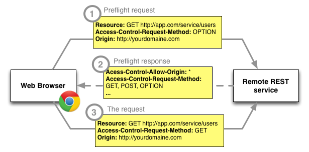

# fetch - ist eine Methode des globalen window Objekts

**Die Fetch-API ermöglicht Webbrowsern, asynchrone HTTP-Anfragen an Webserver zu senden**


- `fetch()` gibt ein promise-Objekt zurück
- ohne Optionen machen wir eine einfache GET-Anfrage, die den Inhalt einer URL herunterlädt.

```javascript
const promise = fetch(url, [options])
//url – the URL to access.
//options – optional parameters: method, headers etc.
```
---
## Beispiel für options bei einem post request

```javascript
const options = {
  method: 'POST',
  headers: {
    'Content-Type': 'application/json;charset=utf-8'
  },
  body: JSON.stringify(data)
}
```
---
Nachdem das promise aufgelöst wurde (Erfolg / Miserfolg) können wir mit den Methoden `then()` und `catch()` Callbacks für die Ergebnis-und für die Fehlerbehandlung definieren.

:exclamation::exclamation::exclamation:fetch löst das promise jedoch auch bei einer HTTP 4xx oder 5xx (Fehler) response vom Server erfolgreich auf. fetch landet nur im catch, wenn die Anfrage gar nicht gestellt werden konnte, bspw. wenn das Netzwerk nicht verfügbar ist oder die Domain gar nicht existiert. Daher sollte bei fetch zusätzlich auch auf `response.ok` oder `response.status` geprüft werden.


```javascript
fetch('https://jsonplaceholder.typicode.com/todos/4') 
 .then((response) => {
   if (response.ok) { 
    return response.json();
   }else {
       throw new Error('response was not ok.')
   }
 })
 .then((data) => { 
   console.log(data); 
 })
 .catch((error) => {
   console.log('Something went wrong.', error); 
 });
```

Das Response-Objekt enthält nicht direkt den eigentlichen JSON response body, sondern ist eine Darstellung der gesamten HTTP-Antwort. Um den JSON body Inhalt aus dem Response-Objekt zu extrahieren, verwenden wir die `json()`-Methode gleich zusetzten mit (JSON.parse(response)), die ein zweites Promise zurückgibt, das mit dem Ergebnis des Parsens aufgelöst wird.

Das response Objekt stellt weitere Methoden bereit bspw. `response.blob()` für img/ video files oder `response.text()` für eine reine txt Datei.

---

## Was ist SOP und CORS?

**SOP**

- SOP (Same-Origin-Policy) ist eine Sicherheitseigenschaft des Webbrowsers, welche verhindert, dass Webseiten (bzw. deren Scripte) auf Inhalte zugreifen können, die aus einer anderen Quelle (Origin) stammen. SOP wurde eingeführt, um  cross-site request forgery attacks zu verhindern.


**CORS**

- Letztendlich stellten die Entwickler jedoch fest, dass es nützlich ist, Ressourcen von APIs von verschiedenen Domains anzufordern und die bereitgestellten Funktionalitäten anderer Anbieter nutzen zu können. Um die gemeinsame Nutzung von Ressourcen unter bestimmten Bedingungen ursprungsübergreifend zu ermöglichen, wurde CORS eingeführt.

- „CORS“ steht für Cross-Origin Resource Sharing. Es ermöglicht uns, Anfragen von einer Webseite an eine andere Webseite im Browser zu senden. 





## Headers

HTTP-Header ermöglichen dem Client und dem Server, zusätzliche Informationen mit einer HTTP-Anfrage (request) oder -Antwort (response) zu übergeben. Wir unterscheiden zwischen request headers und response headers
Hier können Dinge wie CORS, Content-Type, Language etc. geregelt werden.

## preflight

Ein preflight request (Anfrage) ist eine Kurzanfrage, die vom Browser vor der eigentlichen Anfrage gesendet wird. Der preflight gibt dem Server die Möglichkeit zu prüfen, wie die eigentliche Anfrage aussehen wird, bevor sie gestellt wird. 

---

**mehr Lesematerial**

:point_right:[javascript.info/fetch](https://javascript.info/fetch)\
:point_right:[developers.google - working-with-the-fetch-api](https://developers.google.com/web/ilt/pwa/working-with-the-fetch-api)\
:point_right:[do-you-know-why-we-check-for-response-ok-while-using-fetch](https://dev.to/myogeshchavan97/do-you-know-why-we-check-for-response-ok-while-using-fetch-1mkd)\
:point_right:[cors-preflight-requests](https://www.baeldung.com/cs/cors-preflight-requests)\
:point_right:[http-ein-blick-hinter-die-kulissen-des-internets](https://enginsight.com/de/blog/http-ein-blick-hinter-die-kulissen-des-internets/)\
:point_right:[mdn - HTTP response status codes](https://developer.mozilla.org/en-US/docs/Web/HTTP/Status)


**Youtube Videos**

:point_right:[Web Dev Simplified-Learn Fetch API In 6 Minutes](https://www.youtube.com/watch?v=cuEtnrL9-H0)\
:point_right:[Web Dev Simplified-Learn CORS In 6 Minutes](https://www.youtube.com/watch?v=PNtFSVU-YTI)\
:point_right::fire:[Fetch Headers and Why They Matter](https://www.youtube.com/watch?v=5gnz6NZ3TRA)


