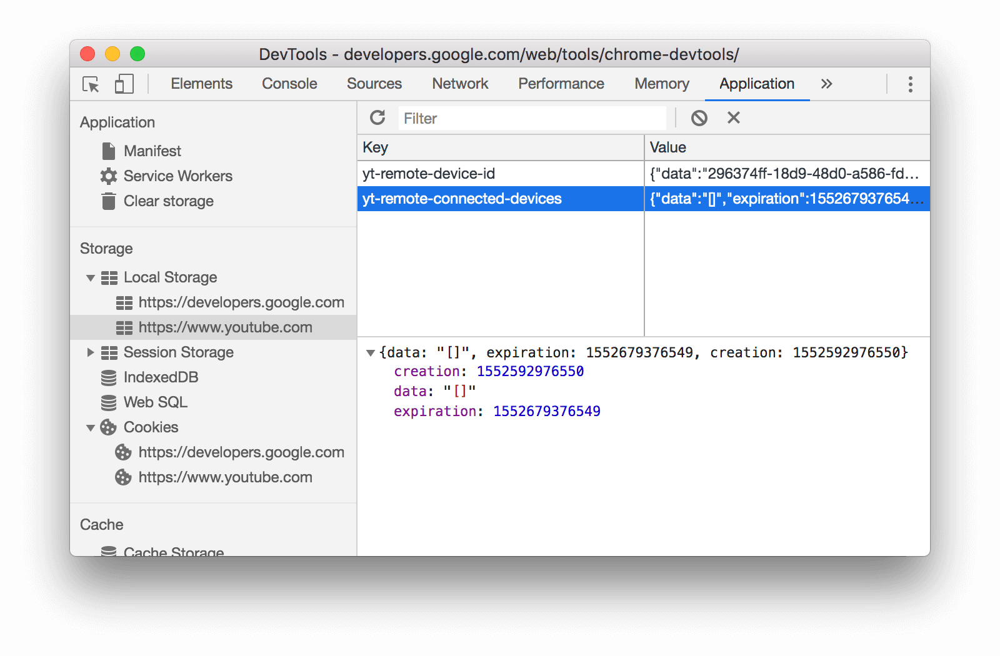

# local storage (ca 5mb lokaler Speicher)

Die Eigenschaft localStorage des window-Objekts stellt uns ein Storage-Objekt zur Verfügung, in dem wir Daten in Form von Key-Value Paaren speichern können. Die Daten werden im Cache des Browsers gespeichert und werden beim Verlassen der Seite nicht gelöscht. Wir können diese Daten beim nächsten Besuch des Users also wieder nutzen. Der Browser führt für jede Domain einen eigenen Local Storage.

:stop_sign: Im local storage sollten wir keine sensiblen Daten, wie z.b. Passwörter oder Adressen speichern. Die Daten können dort sehr leicht von "Hackern" ausgelesen werden.

---

Bei Chrome finden wir den local storage unter "Application".


---

:exclamation::exclamation::exclamation:Wir können im local storage nur strings als key / values speichern. 
:point_right:Zahlen werden automatisch in strings umgewandelt. 

## Daten im local storage speichern

`localStorage.setItem("mykey","myvalue")`

## Daten aus dem local storage holen (lesen)

` localStorage.getItem("mykey")`

## ein Item aus dem local storage entfernen 

`localStorage.removeItem("mykey")`

## den gesamten local storage entfernen

`localStorage.clear()`

## Objekte/ (Arrays) im local storage speichern

da wir im local storage nur strings als key / values speichern können, hilft uns die Methode `JSON.stringify()` zum umwandeln von Objekten/ (Arrays) in strings.

```javascript
const ourArray =[1,2,3,4,5];
localStorage.setItem("ourarraykey",JSON.stringify(ourArray))
```

## Objekte/ (Arrays) aus dem local storage holen (lesen)

beim auslesen, können wir mit der Methode `JSON.parse()` diese wieder zurück in ein Objekt/(Array) umwandeln.

```javascript
const storedArray = localStorage.getItem("ourarraykey");
ourArray = JSON.parse(storedArray);
```