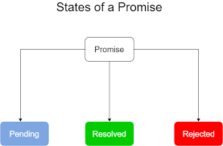
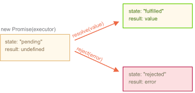
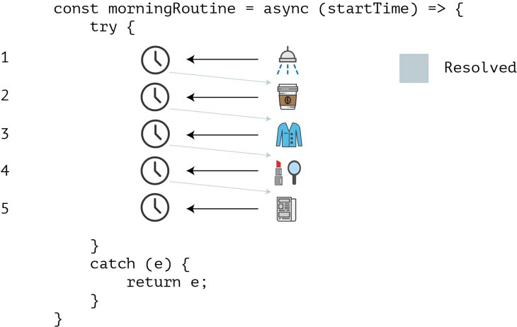

# Promise (seit ECMAScript 2015)


**synchron (blockierender Code) vs asynchron (nicht blockierender Code)**

- synchron (die js-Datei wird von oben nach unten gelesen)
- oder asynchron (gezielt asynchronen clean Code können wir seit ES6 mit Promises schreiben und so die sogenannte callbackhell vermeiden), beim Lesen des Code`s von oben nach unten, wird ein sogenanntes Promise (Versprechen) erstmal auf pending (in Arbeit) gesetzt - ich kümmere mich, um deine Anfrage und sage dir dann Bescheid. Der danach folgende Code wird weiter ausgeführt und zu einem späteren Zeitpunkt, wenn das Promise (Versprechen) ein Ergebnis hat (Erfolg/ Miserfolg ) kann das Ergebnis weiter bearbeitet werden. 






```javascript
const promise = new Promise((resolve, reject)=>{
    let zufall = Math.random()
    if(zufall<0.8){
        resolve('promise fulfilled, data received', data)
    }else{
        reject('promise failed, error received', error)
    }
})
```
Der constructor nimmt zwei Funktionen entgegen, eine für Erfolg und eine für den Miserfolg.

**Promises sind Objekte, die das Ergebnis einer asynchronen Aktion abfangen und es zurück geben, wenn die versprochenen Daten erfolgreich geladen wurden oder ein Fehler aufgetreten ist.**

---
## then( ) 

Die Methode then( ) wird aufgerufen, nachdem das Promise aufgelöst wurde.(Das Promise mit entweder einem Erfolg oder Miserfolg zurück gekommen ist) Dann können wir entscheiden, was mit dem gelösten Versprechen zu tun ist.

```javascript
promise.then((data) => { 
    console.log('Lets do something', data);
}).catch((error) => { 
    console.log('something went wrong', error);
});
```
---
## Promise.all

nutzen wir, wenn wir auf das Ergebnis, mehrerer Versprechen warten müssen, bevor wir weitermachen können

```javascript
Promise.all([promise1, promise2, ....])
  .then(...)
  .catch(...)
```
---
## Vorteil Promises zu Callbacks

Sowohl callbacks als auch promises helfen uns dabei, asynchron Code zu schreiben.
Mit promises können wir jedoch sehr viel sauberen Code schreiben und die sogenannte :point_right:[Callback-Hölle](http://callbackhell.com/) vermeiden. Da wir einfach mehrere .then() miteinander verketten können, und so viele verschachtelte Callbacks vermeiden können. Wenn eine Aufgabe fehlgeschlagen ist, können wir es dem .catch() übergeben.

---

## Promises mit :eight_spoked_asterisk:  async - await :eight_spoked_asterisk:  (syntactic sugar - seit ECMAScript 2017)

`async` - `await` ist eine spezielle Syntax, um komfortabler mit Promises zu arbeiten. Es wird auch als "syntactic sugar" bezeichnet. Wir können unseren asyncronen Code wie eine synchrone Funktion schreiben, alles was wir brauchen sind die Stichwörter async und await. Das Stichwort async wird vor die Funktion gesetzt, um deutlich zu machen, das es sich hierbei, um eine asynchrone Funktion handelt und um die asyncronen Teile unserer Funktion, setzen wir das Stichwort await.



```javascript
const doSomethingAsync = () => {
  return new Promise(resolve => {
    setTimeout(() => resolve('I did something'), 3000)
  })
}

const doSomething = async () => {
  console.log(await doSomethingAsync())
}

```

**mehr Lesematerial**

:point_right:[javascript.info/promise-basics](https://javascript.info/promise-basics)\
:point_right:[callback vs promises](https://dev.to/neisha1618/callbacks-vs-promises-4mi1)\
:point_right:[callbackhell](http://callbackhell.com/)\
:point_right:[javascript-promises](https://dev.to/neisha1618/callbacks-vs-promises-4mi1)\
:point_right:[javascript-promises](https://javascript.plainenglish.io/javascript-promises-39249e5f0e87)\
:point_right:[javascript-promises](https://dev.to/neisha1618/callbacks-vs-promises-4mi1)\
:point_right:[freecodecamp promises](https://www.freecodecamp.org/news/learn-promise-async-await-in-20-minutes/)\
:point_right:[javascript.info async-await](https://javascript.info/async-await)\
:point_right:[mediaevent async-await](https://www.mediaevent.de/javascript/async-await.html)


**Youtube Videos**


:point_right:[Web Dev Simplified-Asynchronous Vs Synchronous Programming](https://www.youtube.com/watch?v=Kpn2ajSa92c)\
:point_right:[Web Dev Simplified-JavaScript Promises In 10 Minutes](https://www.youtube.com/watch?v=DHvZLI7Db8E)\
:point_right:[Traversy Media - Async JS Crash Course - Callbacks, Promises, Async Await](https://www.youtube.com/watch?v=PoRJizFvM7s)


