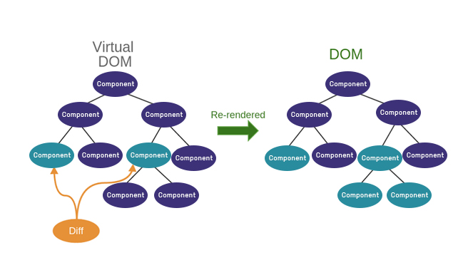
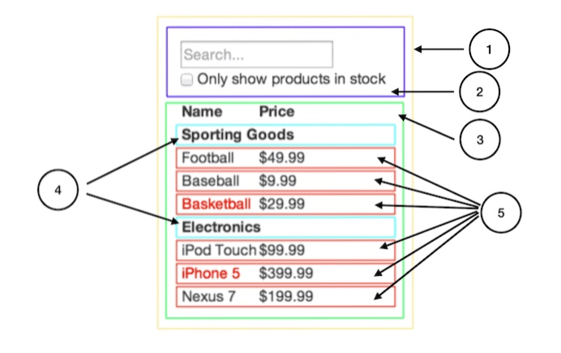
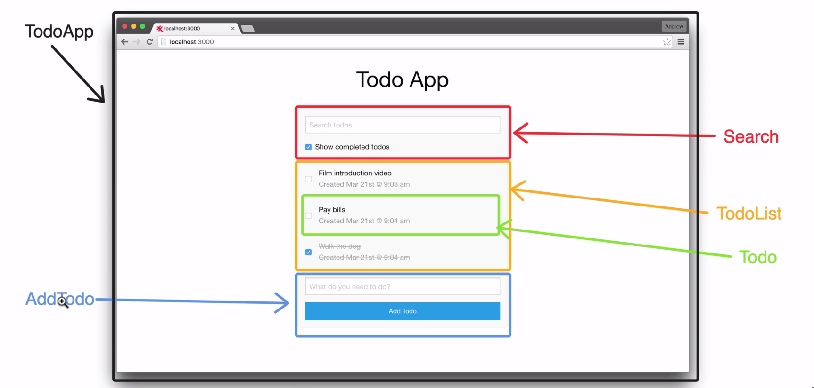
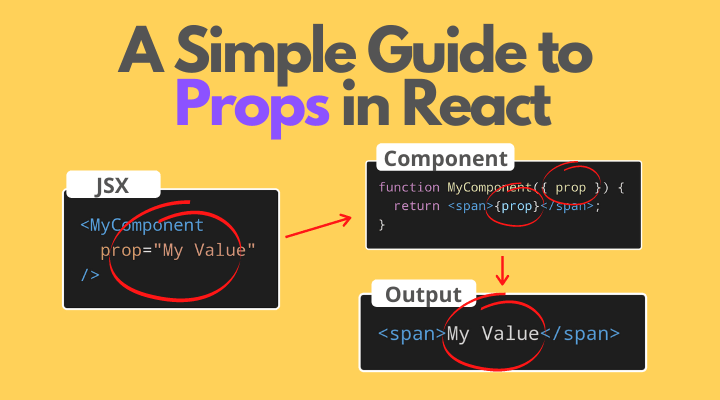

# React :atom_symbol: (Single-Page-Application)

als Single-Page-Application wird eine Webanwendung bezeichnet, die aus einem einzigen HTML-Dokument besteht und deren Inhalte dynamisch nachgeladen werden.

```javascript
npx create-react-app myapp
```


React JS ist eine JavaScript-Bibliothek, die häufig zur Entwicklung von Software verwendet wird, die Daten auf ihrer Benutzeroberfläche ständig aktualisiert. 

Mit React können wir das DOM (gerendertes HTML im Browser) effektiv in JavaScript rekonstruieren und nur die tatsächlich aufgetretenen Änderungen an das DOM übertragen. React „reagiert“ also auf Änderungen im virtuellen DOM und nimmt diese Änderungen im realen DOM vor. Die Änderungen innerhalb der Komponenten können nahtlos gerendert werden, ohne die Seite neu laden zu müssen.




---

## JSX

JSX ermöglicht es uns, HTML-Elemente in JavaScript zu schreiben und sie ohne die Methoden createElement() und/oder appendChild() im DOM zu platzieren. JSX wird zur Laufzeit mit Hilfe von Babel in JavaScript übersetzt. 

:round_pushpin: in JSX nutzen wir CamelCase, bspw. `onClick` anstelle dem Standart HTML `onclick`\
:round_pushpin: Namen die wir bereits in JS nutzen, können nicht in JSX benutzt werden, daher
- `className` anstelle von `class`
- oder `htmlFor` anstelle von `for`
```html
<label htmlFor="namedInput">Name:</label>
<input id="namedInput" type="text" name="name"/>
```
---

## Komponenten (components)

Vom Konzept her sind Komponenten wie JavaScript-Funktionen. Sie akzeptieren beliebige Eingaben (“props”- engl. kurz für properties) und geben React-Elemente zurück, welche beschreiben was auf dem Bildschirm angezeigt werden soll.

**Woher weißt du, was eine eigene Komponente sein sollte?**

Verwende einfach die gleichen Techniken, die du auch verwendest, um zu entscheiden, ob du eine neue Funktion oder ein neues Objekt anlegen möchtest. Eine dieser Techniken ist das Single Responsibility Prinzip, d.h. eine Komponente sollte idealerweise nur eine Aufgabe erledigen. Sobald sie wächst, sollte sie in kleinere Teilkomponenten zerlegt werden.





Als Faustregel gilt: Wenn ein Teil unserer Benutzeroberfläche mehrmals verwendet wird (Button, Panel, Avatar) oder für sich allein komplex genug ist (App, FeedStory, Kommentar), ist dieser ein guter Kandidat für die Extraktion in einen separaten Komponenten.

---
## props 


React ist eine komponentenbasierte Bibliothek, die die Benutzeroberfläche in kleine wiederverwendbare Teile aufteilt. In einigen Fällen müssen diese Komponenten miteinander kommunizieren (Daten aneinander senden). Die Möglichkeit, Daten zwischen Komponenten auszutauschen, bietet uns die Verwendung von `props`(properties).
In React „props“ ist eine Mischung aus den beiden mentalen Modellen: HTML-Attribute (welche Elemente konfigurieren oder ihr Verhalten anpassen können) und Funktionsparameter. Eine Komponente wird wie der Aufruf einer Funktion gerenderd. Die Syntax ist HTML-ähnliche Methode zum Aufrufen dieser Funktion.

:exclamation::exclamation::exclamation:`props`können nur von Eltern-zu-Kind Komponente gesendet werden.




**Auf props welche wir einer anderen Komponente übergeben, können wir entweder mit object notation oder mit Destrukturierung zugreifen.**

:orange_circle: **object notation**

```javascript
import Welcome from './Welcome';

function App() { 
  return (
    <div className="App">
      <Welcome name="John Doe"/>
    </div>
  );
}

function Welcome(props) {
  return <h1>Hello, {props.name}</h1>;
}

export default Welcome;
```
:point_up:**oder**:point_down:

:orange_circle: **Destrukturierung**


```javascript
import Welcome from './Welcome';

function App() { 
  return (
    <div className="App">
      <Welcome name="Jane Doe" />
    </div>
  );
}

function Welcome({name}) {
  return <h1>Hello, {name}</h1>;
}

export default Welcome;
```
---
**mehr Lesematerial**

:point_right:[React docs](https://reactjs.org/)\
:point_right:[thinking-in-react](https://de.reactjs.org/docs/thinking-in-react.html)\
:point_right:[awesome-react-components](https://tutorialzine.com/2017/11/15-awesome-react-components)\
:point_right:[Introducing JSX](https://reactjs.org/docs/introducing-jsx.html)\
:point_right:[how-react-props-relate-to-html-attributes-and-js-functions](https://sawyerh.medium.com/how-react-props-relate-to-html-attributes-and-js-functions-6785a89a299)\
:point_right:[react-reusable-components](https://www.robinwieruch.de/react-reusable-components/)\
:point_right:[react-props-cheatsheet](https://www.freecodecamp.org/news/react-props-cheatsheet/)\
:point_right:[react-children-the-misunderstood-prop](https://www.netlify.com/blog/2020/12/17/react-children-the-misunderstood-prop/)


**nützliche React tools :wrench::screwdriver:**

:point_right:[chrome extension-react-developer-tools](https://chrome.google.com/webstore/detail/react-developer-tools/fmkadmapgofadopljbjfkapdkoienihi?hl=en)\
:point_right:[vs-code-extension-es7](https://chefvivica.medium.com/best-react-extension-for-vs-code-es7-react-redux-graphql-react-native-snippets-7586a6acece0)


https://www.youtube.com/watch?v=kHJSNFU7H4U


