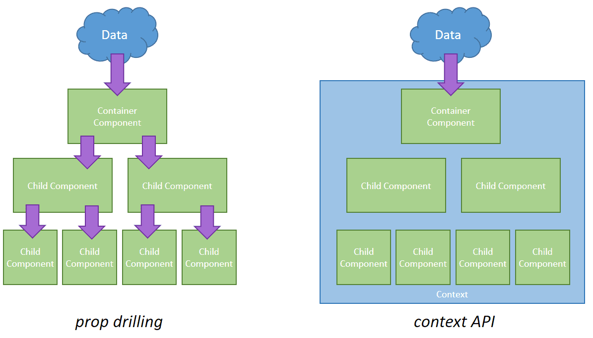

# context API - vereinfacht das Konsumieren von Daten


## Wann verwendet man context?

- context dient dazu, Daten auszutauschen, die für einen Baum von React-Komponenten als „global“ angesehen werden können, wie z. B. der aktuell authentifizierte Nutzer, das theme oder die bevorzugte Sprache. 

- context wird hauptsächlich verwendet, wenn auf einige Daten, von vielen Komponenten auf verschiedenen Verschachtelungsebenen zugegriffen werden muss. 

- Daten im context, sollten Daten sein, welche nicht zu oft aktualisiert werden müssen, da context nicht als Zustandsverwaltungssystem erstellt wurde.

- Nachteil von context ist, das es die Wiederverwendung von Komponenten erschwert




typischen React-Anwendung (prop-drilling) vs context API 

---


---

## Wie verwendet man context?

**Es gibt vier Schritte zur Verwendung des React Context:**

```javascript
import React from 'react';

export const UserContext = React.createContext();

export default function App() {
  return (
    <UserContext.Provider value="german">
      <User />
    </UserContext.Provider>
  )
}

function User() {
  const value = React.useContext(UserContext);  
    
  return <h1>{value}</h1>;
}
```

---

:orange_circle: context mit der createContext-Methode erstellen

```javascript
const UserContext = React.createContext();
```
:orange_circle: In unserer App-Komponente verwenden wir UserContext mit dem `UserContext.Provider`. Wir wickeln die Provider-Komponente um den Komponentenbaum (in diesem Fall User). Die eingebetteten Components können nun auf die Daten im context zugreifen. 

:orange_circle: Im UserContext.Provider legen wir den Wert fest, den wir an unseren gesamten Komponentenbaum weitergeben möchten. 
`value="german"`

:orange_circle: In User, oder wo immer wir den zur Verfügung gestellten context verwenden wollen, können wir das gesamte context object an React.useContext() übergeben
```javascript
const value = React.useContext(UserContext);
```


---

**mehr Lesematerial**

:point_right:[how-use-react-context](https://devtrium.com/posts/how-use-react-context-pro)\
:point_right:[freecodecamp - react-context-for-beginners](https://www.freecodecamp.org/news/react-context-for-beginners/)


**Youtube Videos**

:point_right:[Web Dev Simplified-Learn useContext In 13 Minutes](https://www.youtube.com/watch?v=5LrDIWkK_Bc)


