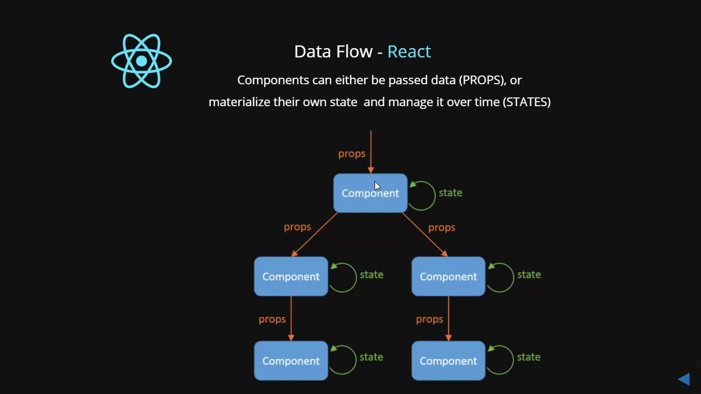

# state

Was ist der Unterschied zwischen `state` und `props`?
props (kurz für „properties“) und state sind beides reine JavaScript-Objekte. Obwohl beide Informationen enthalten, die das Rendern der Komponente beeinflussen, unterscheiden sie sich in einem wichtigen Punkt: props werden an die Komponente übergeben (ähnlich wie Funktionsparameter), während der state innerhalb der Komponente verwaltet wird (ähnlich wie deklarierte Variablen in einer Funktion).




- props bieten uns die Möglichkeit, Daten von Eltern zu Kind weiterzugeben.
- state ist für die Interaktivität zuständig (d.h. für Daten, die sich im Laufe der Zeit ändern) /
state enthält „private“ Informationen für die Komponente zum Initialisieren und Ändern!


## Hooks (state in einer funktionalen Komponente)

```javascript
 1:  import React, { useState } from 'react';
 2:
 3:  function Example() {
 4:    const [count, setCount] = useState(0);
 5:
 6:    return (
 7:      <div>
 8:        <p>You clicked {count} times</p>
 9:        <button onClick={() => setCount(count + 1)}>
10:         Click me
11:        </button>
12:      </div>
13:    );
14:  }
```
- Zeile 1: Wir importieren den `useState` Hook von React. (durch diesen haben wir einen lokalen state in unserer funktionalen Komponente)
- Zeile 4: über den useState Hook können wir einen Initialwert (Beispiel `0`) für unsere state Variable (Beispiel `count`) setzen. Der useSate Hook liefert uns zusätzlich eine Methode (Beispiel `setCount`), über welche wir unsere Variabale ändern können.
- Zeile 9: Wenn der Nutzer klickt, rufen wir `setCount` mit einem neuen Wert auf. 

## :exclamation::exclamation::exclamation: `state` sollte nie direkt geändern werden!

Der `state` sollte nicht direkt geändert werden! Wir nutzen hierfür ausschließlich die spezielle Methode `setState( )`. Durch die Methode `setState( )` wird das Neu-Rendern für die aktualisierten Teile ausgelöst. 

---

**mehr Lesematerial**

:point_right:[javascript.info/promise-basics](https://javascript.info/promise-basics)\


**Youtube Videos**

:point_right:[Web Dev Simplified-React State Vs Props](https://www.youtube.com/watch?v=IYvD9oBCuJI)\
:point_right:[Dev ED-React State and Props | Learn React For Beginners](https://www.youtube.com/watch?v=dMH1_YtUTSQ)\

