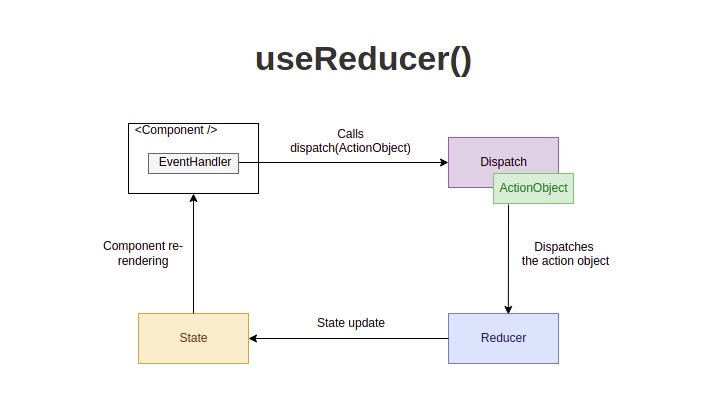
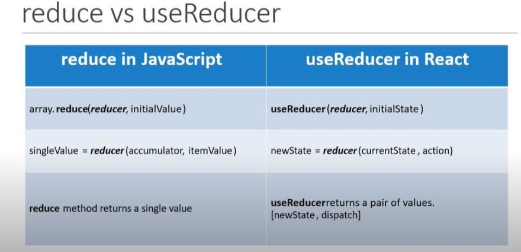

# useReducer Hook

`useReducer()` ist eine Alternative zu `useState()` und eignet sich gut bei relativ komplexen state updates (min 2-3 Aktualisierungsaktionen). Für die einfache state Verwaltung eignet sich `useState()` besser.


---
```javascript
const [state, setState]=useState(initialState)//initial state 0
```
```javascript
const [state, dispatch] = useReducer(reducer, initialState) //initial state {counter: 0 } =>meist komplexer objects;
```
- Der Hook `useReducer(reducer, initialState)` akzeptiert zwei Argumente: die Reducer-Funktion und den initial state (Anfangszustand). Der Hook gibt dann ein Array aus 2 Elementen zurück: den aktuellen `state` und die Dispatch-Funktion `dispatch`.

- Der Unterschied zum `useState` hook ist, das wir unseren state, nicht direkt über setState updaten, sondern über eine dispatch Funktion, welche den reducer mit einem action object aufruft. 

----

## :jigsaw: useReducer Hook in einzelne Teile zerlegt :jigsaw:

### :arrow_right: Initial state

Der Anfangszustand bei der Initialisierung. z.b. 
```javascript
const initialState = { 
  counter: 0 
};
```
---

### :arrow_right: Action object

Das Aktionsobjekt ist ein Objekt, das beschreibt, wie der Status aktualisiert wird.
Das Aktionsobjekt hat als Eigenschaft einen string, welches die Art des state updates beschreibt. welches der reducer durchführen soll z.b. ("increase", "decrease",...) 
```javascript
const actionObject = {
  type: 'increase'
};
```
Als zweite Eigenschaft können wir dem Aktionsobjekt noch einige nützliche Informationen mitgeben (auch bekannt als Payload). Die Payload enthält Informationen, welche der reducer benötigt, um den state upzudaten. 

```javascript
const actionObject2 = {
  type: 'add',
  user: { 
    name: 'Jane Doe',
    email: 'jane@mail.com'
  }
};
```
---
### :arrow_right: Dispatch

Wenn der state geupdated werden soll (bspw. durch einen eventhandler, fetch...) rufen wir die dispatch Funktion auf und übergeben dieser das Aktionsobjekt 

```javascript
<button onClick={() => dispatch({type: "increase"})}>+</button>

<button onClick={() => dispatch({type: "add", payload: {name: 'Jane Doe',email:'jane@mail.com'}})></button>
```
---

### :arrow_right: Reducer

Der Reducer ist eine reine Funktion, die 2 Parameter akzeptiert: den aktuellen state und ein Aktionsobjekt. Je nach Aktionsobjekt aktualisiert die Reducer-Funktion den state und gibt den neuen state zurück. 

```javascript

function reducer(state, action) {
  switch (action.type) {
    case 'increment':
      return {count: state.count + 1};
    case 'decrement':
      return {count: state.count - 1};
    default:
      throw new Error(`Unknown action type: ${action.type}`);
  }
}
```
---
:fire::ok_hand: In Apps mit mehreren Komponenten können wir die dispatch Funktion als props an die jeweilige Komponente runterreichen `dispatch={dispatch}` und in dieser den state einfach updaten. 

---





---

**mehr Lesematerial**

:point_right:[usereducer-vs-usestate](https://www.robinwieruch.de/react-usereducer-vs-usestate/)\
:point_right:[how-to-use-react-usereducer-hook](https://devtrium.com/posts/how-to-use-react-usereducer-hook)


**Youtube Videos**

:point_right:[Web Dev Simplified - Learn useReducer In 20 Minutes](https://www.youtube.com/watch?v=kK_Wqx3RnHk)


