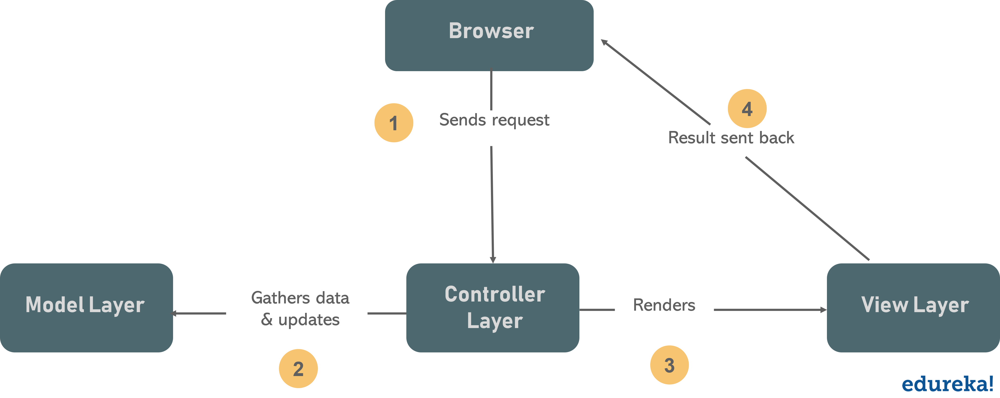
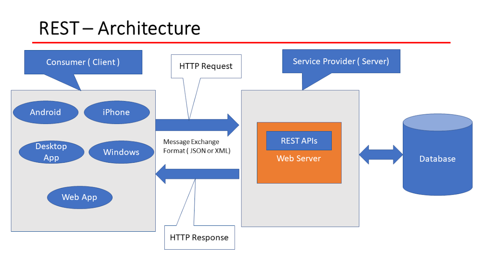
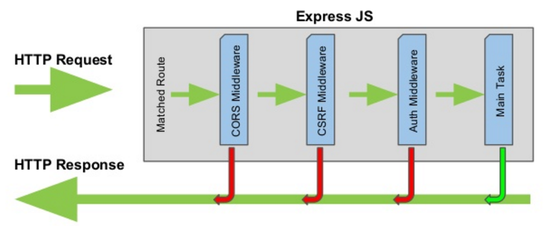

# Express - back end web application framework für Node.js

### :red_circle: Model-View-Controller

Model-View-Controller (MVC) ist ein software design pattern, welches häufig zur Entwicklung von user interfaces verwendet wird.




- Model: stellt die Datenlogik bereit und interagiert mit der Datenbank
- View: kümmert sich um die Datenrepräsentation
- Controller: verarbeitet die Anfrage des Nutzers

---

### :red_circle: C für Controller

```javascript
app.get(<path>, <controller>)
```
---

### :red_circle: REST API (RESTful API)

**REST - representational state transfer**



**HTTP Methods**
- **GET/cars**       :heavy_minus_sign: um eine Ressource abzurufen
- **PUT/cars/:id**   :heavy_minus_sign: um eine Ressource zu aktualisieren
- **POST/cars**      :heavy_minus_sign: um eine Ressource zu erstellen
- **DELETE/cars/:id**:heavy_minus_sign: um eine Ressource zu entfernen

---

### :red_circle: Routing

Routing bezieht sich darauf, wie die Endpunkte (URIs) einer Anwendung auf Client Anfragen reagieren

- Eine Route-Methode wird von einer der HTTP-Methoden abgeleitet und an eine Instanz der Express-Klasse angehängt. `get`
- Route-paths in Kombination mit einer Route-Methode definieren die Endpunkte, der Anfrage `'/about'`

```javascript
app.get('/about', function (req, res) {
  res.send('about')
})
```
- Route-Parameter sind benannte URL-Segmente, die verwendet werden, um die an ihrer Position in der URL angegebenen Werte zu erfassen. Die erfassten Werte werden in das req.params-Objekt gefüllt, wobei der Name des im Pfad angegebenen Route-Parameters als jeweiliger Schlüssel verwendet wird. `:userId, :bookId`

```javascript
app.get('/users/:userId/books/:bookId', function (req, res) {
  res.send(req.params)
})
```
---
###  :red_circle: Middleware

Express-Middleware sind Funktionen, die während des Lebenszyklus einer Anfrage an den Express-Server ausgeführt werden. Jede Middleware hat Zugriff auf die HTTP-Anfrage (request) und -Antwort (response) für jede Route (oder jeden Pfad), an die sie angehängt ist.




 :large_blue_diamond:**Middleware-Funktionen können die folgenden Aufgaben ausführen:**

- sie führen einen beliebigen Code aus.
- nehmen Änderungen am Anfrage (request)- und Antwortobjekten (response) vor.
- beenden Sie den Request-Response-Zyklus.
- rufen die nächste Middleware-Funktion im Stack auf.

---
 :large_blue_diamond:**Arten von Middleware**

:large_orange_diamond: integrierte Middleware von Express nutzen, sogenannte `Application-level middleware` z.B den bodyparser. 
```javascript
app.use(express.json());
app.use(express.urlencoded({extended: true}))
```
---

:large_orange_diamond: Middleware von Drittanbietern (npm packages) nutzen, z.b. `morgan` (HTTP request logger middleware)
```javascript
app.use(morgan("common"))
```
---

:large_orange_diamond: Wir können unsere eigene Middleware für Express.js schreiben, z.b. CORS
```javascript
exports.security = (req, res, next) =>
{
    res.header('Access-Control-Allow-Origin', '*');
    res.header('Access-Control-Allow-Headers', 'Origin, x-Requested-With, Content-Type, Accept');
    res.header('Access-Control-Allow-Methods', 'POST, GET, PUT, DELETE, OPTIONS');

    next();
};
```
Wenn die aktuelle Middleware-Funktion den Anfrage-Antwort-Zyklus nicht beendet, muss sie `next()` aufrufen, um die Steuerung an die nächste Middleware-Funktion zu übergeben. Andernfalls bleibt die Anfrage hängen.

---

### :large_orange_diamond:Error-handling-middleware

Error-handling-middleware-Funktionen werden genauso wie andere Middleware-Funktionen definiert, außer mit vier statt drei Argumenten, `(err, req, res, next)`

Fehler, die von asynchronen Funktionen zurückgegeben werden, die von route handlern und Middleware aufgerufen werden, müssen an die Funktion `next()` übergeben werden, wo Express sie abfängt und verarbeitet. z.b.

```javascript
app.get('/', function (req, res, next) {
  fs.readFile('/file-does-not-exist', function (err, data) {
    if (err) {
      next(err) // Pass errors to Express.
    } else {
      res.send(data)
    }
  })
})

app.use(function (err, req, res, next) {
  console.error(err.stack)
  res.status(500).send('Internal Server Error')
})
```

---

**mehr Lesematerial**

:point_right:[Express - routing](https://expressjs.com/en/guide/routing.html)\
:point_right:[Express - middleware](https://expressjs.com/en/guide/using-middleware.html)\
:point_right:[Express - guide using middleware](https://expressjs.com/en/guide/using-middleware.html)\
:point_right:[academind - cross-site-resource-sharing-cors](https://academind.com/tutorials/cross-site-resource-sharing-cors)\
:point_right:[Express - error-handling-middleware](https://expressjs.com/en/guide/error-handling.html)\
:point_right:[why-thunder-client-is-better-than-postman?](https://enlear.academy/why-thunder-client-is-better-than-postman-dfe7bf484397)


**Tools API testing**

:point_right:[thunderclient - vs-extension](https://www.thunderclient.com/)\
:point_right:[Postman](https://www.postman.com/downloads/)


**Youtube Videos**

:point_right:[Web Dev Simplified - MVC Explained in 4 Minutes](https://www.youtube.com/watch?v=DUg2SWWK18I)


