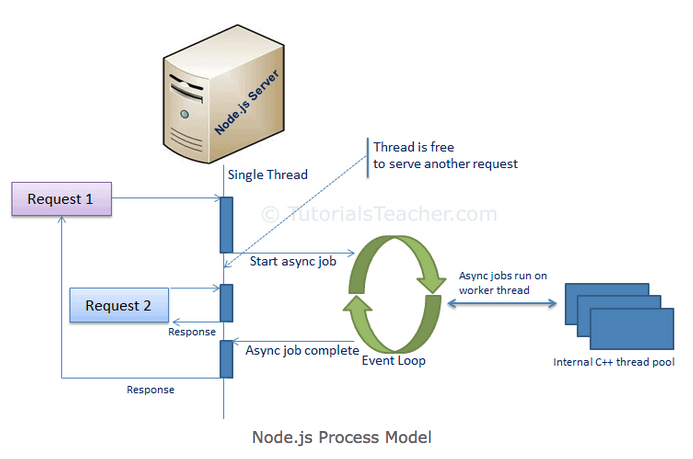
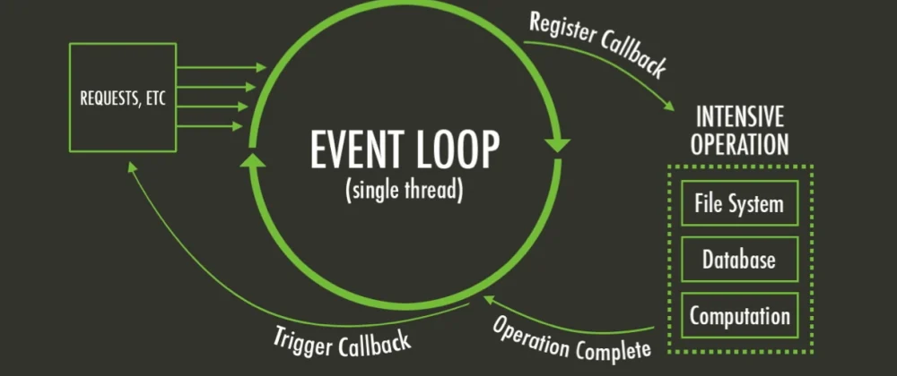
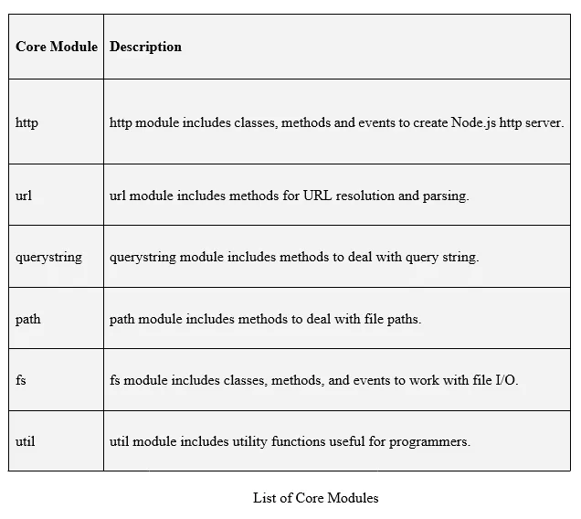

# Node.js

Node.js ist eine plattformübergreifende Open-Source-JavaScript-Laufzeitumgebung, die JavaScript-Code außerhalb eines Webbrowsers ausführen kann. Damit kann zum Beispiel ein Webserver betrieben werden.

Als asynchrone, Event-basierte Laufzeitumgebung wurde Node.js speziell für die Entwicklung von skalierbaren Netzwerkanwendungen entworfen.
Node.js wurde mit besonderem Fokus auf die Performance entwickelt. 

Zugriffe auf das Netzwerk und Dateisystem werden über die von Libuv bereitgestellte Ereignisschleife (event loop) und den darunterliegenden Thread Pool abgearbeitet. 

---
## Built-in-Modulen

Node.js verfügt über eine Reihe von Built-in-Modulen, welche mit Installation bereits geliefert werden. Weitere können individuell mit npm dem Standard package manager für Node.js installiert werden

z.b.

**mehr Lesematerial**

:point_right:[node.js documentation](https://nodejs.dev/learn/nodejs-accept-arguments-from-the-command-line)\
:point_right:[tutorialsteacher - node.js](https://www.tutorialsteacher.com/nodejs)

