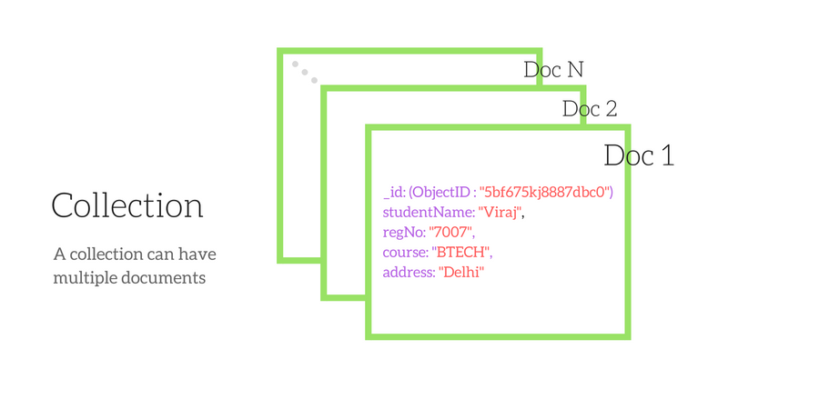

# MongoDB

## 	:orange_square: Was ist MongoDB?

MongoDB ist eine NoSQL Datenbank, die Ihre Daten als Dokumente speichert. 



```javascript
{ 
   studentName:"Viray",
   regNo:"7007",
   course:"BTECH",
   address:"Delhi" 
}
```

Einer der Schlüsselfaktoren bei MongoDB, ist die Flexibilität in Bezug auf die Struktur. Obwohl das Studentobjekt im Beispiel den `studentName`, `regNo`, `course` und `address` als Eigenschaften entält, sind diese Eigenschaften nicht in jedem Studentdokument erforderlich, das Teil der Collection (Sammlung) ist. Dies unterscheidet MongoDB stark von einer SQL-Datenbank, welche ein streng definiertes Datenbankschema für jedes gespeicherte Objekt erfordert.

---
## :orange_square: Was ist Mongoose?

Bei der Möglichkeit, dynamische Objekte zu erstellen, die als Dokumente in der Datenbank gespeichert werden, kommt Mongoose ins Spiel.
Mongoose ist ein Object Document Mapper (ODM). Wir können ein Schema für jeden Typ von Dokumenten anlegen. Dieses Schema beschreibt grundlegend das Datenkonstrukt eines Dokuments. Im Schema können wir Datentypen, Standardwerte (defaults) und eine kleine Validierung hinzufügen.


### Schema

```javascript
const studentSchema = new mongoose.Schema({
    profilePicture: Buffer,
    studentName: String,
    regNo:{
            type: String,
            required: true
        },
    course: String,
    adress: { 
        type: String,
        default: "Delhi"    
    },
})
```

### Mongoose SchemaTypes 

- String
- Number
- Date
- Buffer
- Boolean
- Mixed
- ObjectId
- Array

---
### Mongoose Model

Ein Mongoose-Modell erstellt beim Speichern ein Dokument in MongoDB mit den Eigenschaften, die durch das Schema definiert sind, von dem es abgeleitet ist.

Zum Erstellen eines Modells, müssen wir den Modellkonstruktor für die Mongoose-Instanz aufrufen und ihm den Namen der Sammlung und einen Verweis auf die Schemadefinition übergeben.


```javascript
module.exports = mongoose.model('Student', studentSchema)
```

:point_down:neues Dokument erstellen

```javascript
const Student = require('./models/student')

const newStudent = new Student({
   studentName: "Jane",
   regNo:"7008",
   address:"Mumbay",
})
```
---

**mehr Lesematerial**

:point_right:[docs mongodb install / start](https://docs.mongodb.com/manual/tutorial/install-mongodb-on-ubuntu/)\
:point_right:[docs mongoose](https://mongoosejs.com/docs/guide.html)


