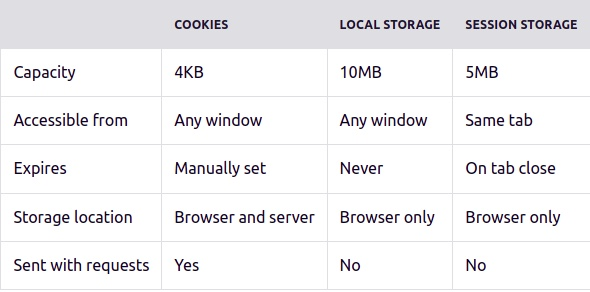

# Cookies :cookie:

Ein Cookie ist eine kleine Textdatei, welche entweder vom Webserver an den Browser gesendet wird, oder im Browser von einem Skript (JavaScript) erzeugt wird. Ob das Cookie im Frontend oder Backendend erzeugt wird, hängt davon ab, welche Informationen gespeichert werden sollen.

Typischerweise wird ein HTTP-Cookie vom Server verwendet, um zu erkennen, ob zwei Anfragen von demselben Browser stammen, z.b. wenn ein Benutzer angemeldet bleibt. Der Cookie merkt sich zustandsbehaftete (stateful) Informationen für das zustandslose (stateless) HTTP-Protokoll. 


### :large_blue_circle: Cookies werden hauptsächlich für drei Zwecke verwendet:

:diamonds:**Sitzungsverwaltung**

Login, Warenkörbe, Spielergebnisse oder alles andere, was der Server sich merken sollte

:diamonds:**Personalisierung**

Benutzereinstellungen wie z.b. Theme, Sprachauswahl

:diamonds:**Tracking**

Aufzeichnen und Analysieren des Nutzerverhaltens

---



:bangbang: Cookies werden mit jedem request gesendet, was die Performance negativ beeinflussen kann. (wenn möglich, zum Speichern von nicht sensiblen! Daten, auf den Local Storage oder Session Storage zurückgreifen, welche mit HTML5 eingeführt wurden) 

---
### :large_blue_circle: Cookie erstellen

Es ist zwar möglich, Cookies im Browser mit `document.cookie` zu erstellen, aber meistens ist das Backend dafür verantwortlich, Cookies in die `response` zu setzen, bevor es an den Client gesendet wird.

:diamonds:Frontend
```javascript
document.cookie = "username=John; expires=Thu, 18 Dec 2013 12:00:00 UTC";
```


:diamonds:Backend
```javascript
// ---------key,--------  value--
res.cookie('access_token', token,
    {   
        //This setting makes cookies unavailable to JavaScript and prevents their theft using XSS.
        httpOnly: true,
        // maxAge should be set in milliseconds, 
        // A negative value results in no "Max-Age" attribute
        // in which case the cookie is removed when the browser is closed.
        maxAge: 1000 * 60 * 60 * 24 
}).status(200)
  .json({
        sucess: true,
        message: "User is logged in!"
    });
```


---

### :large_blue_circle: Sicherheit

Wir können auf zwei Arten den Zugriff auf Cookies beschränken: 

- `Secure`-Attribut: wird nur über das HTTPS Protokol versendet (Ausnahme localhost)
- `HttpOnly`-Attribut (HttpOnly-Cookies sind für die document.cookie-API nicht zugänglich; Sie werden nur an den Server gesendet.)
 
---
### :large_blue_circle: More Info zu Cookies

- Die Website kann nur ihr eigenes Cookie lesen. Cookies einer anderen Website/Domain kann nicht gelesen werden. Diese Sicherheit wird durch den Browser gewährleistet.

- Cookie wird nicht zwischen verschiedenen Browsern geteilt. Das bedeutet, dass ein Browser das von einem anderen Browser gespeicherte Cookie nicht lesen kann, selbst wenn es sich um dieselbe Domäne handelt.

- Die Anzahl der vom Webserver für eine bestimmte Domain gesendeten Cookies kann nicht unbegrenzt sein. Die Einschränkung wird vom Browser gesetzt, um den Speicherplatzverbrauch einzuschränken, sind etwa 20–25 Cookies pro Domain zugelassen.

---

**mehr Lesematerial**

:point_right:[fcc - everything-you-need-to-know-about-cookies](https://www.freecodecamp.org/news/everything-you-need-to-know-about-cookies-for-web-development/)\
:point_right:[mdn HTTP cookies](https://developer.mozilla.org/en-US/docs/Web/HTTP/Cookies)\
:point_right:[W3schools document.cookie](https://www.w3schools.com/js/js_cookies.asp)\
:point_right:[tutorialspoint document.cookies ](https://www.tutorialspoint.com/javascript/javascript_cookies.htm)


**Youtube Videos**

:point_right:[Web Dev Simplified-What - JavaScript Cookies vs Local Storage vs Session](https://www.youtube.com/watch?v=GihQAC1I39Q)


