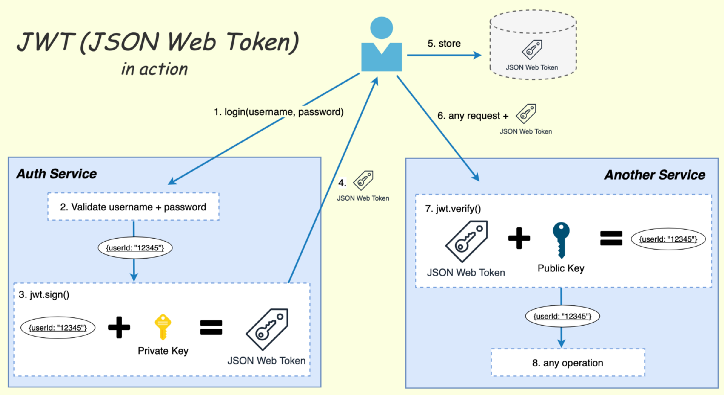

# JSON Web Token (JWT)

JWT ist die Abkürzung für “JSON Web Token”, das für den Einsatz im Web konzipiert wurde. Typisches Einsatzgebiet für JWT ist die fortlaufende Authentifizierung bei SSO (“single sign-on”). JWT bietet Sicherheit durch das "secret", welches nur dem Server bekannt ist. 





## :red_circle: Aufbau eines JWT-Token

**HEADER.PAYLOAD.SIGNATURE**

Ein JWT-Token besteht also aus drei Teilen, die durch Punkte (.) voneinander getrennt sind. Hier sind beispielhafte Belegungen dieser Teile:

```javascript
Header: “eyJhbGciOiJIUzI1NiIsInR5cCI6IkpXVCJ9”
Payload: “eyJpZCI6IjEyMzQ1Njc4OTAiLCJuYW1lIjoiTWFydGhhIFRlc3RlciJ9”
Signatur: “AfF8fGzbhhpS9k-rgJt7RlZaUnP9phwmnPTku2fs4o0”
```
---
### :diamonds: Header

Der Header beschreibt den Signatur- und/oder Verschlüsselungsalgorithmus und den Token-Typ. Die Daten werden im JSON-Format abgelegt und Base64-kodiert. Das vorliegende Beispiel sieht im Klartext so aus:

```javascript
{"alg":"HS256","typ":"JWT"}
```

### :diamonds: Payload

Als Payload wird das JSON-Objekt bezeichnet, das aus einer “beliebigen” Anzahl von Key/Value-Paaren besteht. Diese Key/Value-Paare werden ”Claims” genannt Der Payload  wird ebenfalls Base64-kodiert. Im Beispiel hat der Payload folgenden Inhalt:

```javascript
{ "id": "1234567890", "name": "Jane Doe" }
```

### :diamonds: Signature

Das letzte Element ist die Signatur, die aus dem Header und der Payload berechnet wird. Der Algorithmus kann in Pseudocode wie folgt beschrieben werden:

```javascript
content = base64UrlEncode(header) + "." + base64UrlEncode(payload);
signature = HMACSHA256(content, secret);
```

---

### :small_orange_diamond: Registrierte Claims 

(Es handelt sich hierbei um Keys, deren Zweck in einem Standard festgelegt ist.) (optionale Angaben)
bspw.: `exp` (expiration time): der Zeitpunkt, zu dem das JWT-Token nicht mehr akzeptiert werden darf
Ein JWT-Token, das nie abläuft, ist gefährlich, wenn das Token gestohlen wird, kann immer jemand auf die Daten des Benutzers zugreifen.

---
```javascript
// Token wird erstellt, wir geben die Payload, das serverseitige Secret, und die Gültigkeit an
const token = jwt.sign({
          email: userLastLogin.email,
          userId: userLastLogin._id,
        }, process.env.SECRET_TOKEN, { expiresIn: '24h' }
        )
//  vom Client gesendetes Token verifizieren 
//  (die gesendeten Daten werden mit dem am nur am Server gespeicherten Secret verglichen)
jwt.verify(token, process.env.SECRET_TOKEN);
```


**mehr Lesematerial**

:point_right:[json-web-token-jwt-im-detail](https://blog.codecentric.de/2016/11/json-web-token-jwt-im-detail/)


**Youtube Videos**

:point_right:[Web Dev Simplified-What Is JWT and Why Should You Use JWT](https://www.youtube.com/watch?v=7Q17ubqLfaM)


